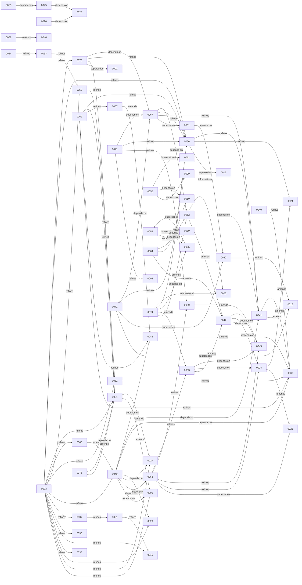

# ADR 依赖与演进图

> 由 schema-v2 front matter、冻结 legacy identity baseline 与当前 calibration 生成；禁止手工编辑。
> 审查基线：`83af67d0702a7bfda2fa3a760b56dbef47c663c7`；组合审查日期：2026-07-12。

## 未迁移 legacy ADR

以下 ADR 仍由内容哈希 baseline 冻结；修改时必须迁移相关 front matter/条款：
0001, 0002, 0003, 0004, 0005, 0006, 0007, 0008, 0009, 0010, 0011, 0012, 0013, 0014, 0015, 0016, 0017, 0019, 0020, 0021, 0022, 0023, 0024, 0025, 0026, 0027, 0028, 0029, 0030, 0031, 0035, 0036, 0037, 0038, 0039, 0040, 0041, 0042, 0043, 0044, 0045, 0046, 0047, 0048, 0049, 0050, 0051, 0052, 0053, 0054, 0055。

## 显式关系

| Source | Relation | Target | Scope |
| --- | --- | --- | --- |
| 0021 | refines | 0015 | OCR 字段级 draft provenance |
| 0025 | depends-on | 0023 | Android 图表依赖政策 |
| 0026 | depends-on | 0023 | Web 图表依赖政策 |
| 0028 | amends | 0022 | 公网 /web 权限入口 |
| 0028 | amends | 0024 | /web loopback 网络边界 |
| 0030 | refines | 0016 | 内嵌长任务执行和容量边界 |
| 0031 | depends-on | 0030 | 历史 v1 migration 长任务 |
| 0037 | refines | 0021 | OCR facts 与学习反馈事实层 |
| 0040 | refines | 0038 | 子资源 outbox target 与 parent-only undo |
| 0041 | amends | 0016 | SQLite 部署条款 |
| 0041 | amends | 0038 | CAS token 改为 row_version |
| 0042 | amends | 0038 | outbox-routed request idempotency |
| 0047 | depends-on | 0041 | PostgreSQL-only runtime |
| 0047 | depends-on | 0028 | /owner loopback 与 /web 公网边界 |
| 0047 | depends-on | 0045 | 持久 signing key |
| 0049 | depends-on | 0001 | 整数金额 |
| 0049 | depends-on | 0068 | 当前家庭身份、RBAC 与信任边界 |
| 0049 | depends-on | 0027 | FX authority |
| 0049 | depends-on | 0029 | bill-split privacy |
| 0049 | depends-on | 0038 | OCC/outbox |
| 0049 | depends-on | 0041 | PostgreSQL row_version |
| 0049 | depends-on | 0042 | idempotency |
| 0050 | depends-on | 0009 | Version Catalog |
| 0050 | depends-on | 0010 | 依赖审计 |
| 0050 | informational | 0011 | AGP 9.2 工具链历史上下文 |
| 0051 | refines | 0038 | 删除恢复与 retention |
| 0052 | refines | 0051 | 主数据进入回收站的事实边界 |
| 0053 | refines | 0052 | merchant catalog 删除边界 |
| 0054 | refines | 0053 | merchant rename/merge |
| 0055 | supersedes | 0025 | Android Vico 选型全部替换为原生 Canvas |
| 0056 | supersedes | 0039 | 以持续状态账本替代一次性 ADR 实施快照 |
| 0056 | informational | 0065 | 0065 已取代本 ADR 的状态模型、registry 与机器治理机制 |
| 0057 | amends | 0042 | current-state replay、持久 stale in-progress 与 reclaim 语义 |
| 0058 | amends | 0046 | 同一 reminder key 只提醒一次的绝对表述 |
| 0059 | amends | 0045 | per-install signing key 的 restore/clone 身份、首次生成与轮换边界 |
| 0060 | amends | 0049 | forgiveness 的 canonical/as-of fold 与 DebtVoid 灾难重建 |
| 0061 | amends | 0001 | 金额单位从固定人民币分收紧为 currency-aware integer minor units |
| 0061 | amends | 0027 | home currency 从固定 CNY 收紧为持久 installation-global binding |
| 0062 | amends | 0047 | 安装数据/升级、启动验收和生命周期实施叙述 |
| 0062 | depends-on | 0041 | PostgreSQL-only、Alembic、pg_dump/pg_restore 与 schema compatibility |
| 0062 | informational | 0006 | Windows PowerShell 5.1 编码与脚本运行边界 |
| 0063 | amends | 0047 | owner bootstrap secret 的一次性/可恢复语义和安装交接 |
| 0063 | depends-on | 0028 | loopback owner 边界与公网拒绝面 |
| 0063 | depends-on | 0045 | 持久签名 key、占位符拒绝和启动 fail-closed |
| 0064 | amends | 0047 | 构建 provenance、代码签名和未签名 Windows 验收叙述 |
| 0064 | depends-on | 0010 | 依赖版本、许可证、维护状态和人工升级审计 |
| 0064 | depends-on | 0062 | 安装生命周期所消费的 release config、payload 和最终 artifact identity |
| 0065 | supersedes | 0056 | 双状态模型、人工状态账本、新 ADR 质量门和机器守护机制；历史真实性原则继续保留 |
| 0066 | supersedes | 0017 | 早期灰度上传工具的产品范围、角色和人工确认入口叙述 |
| 0066 | refines | 0024 | member、owner、维护者和审计者的跨端交互边界 |
| 0066 | refines | 0041 | PostgreSQL 权威与 Windows/PostgreSQL adapter 的领域隔离 |
| 0067 | supersedes | 0031 | PostgreSQL-only 现行 schema 初始化、升级、兼容、回退与恢复范围；0031 的 SQLite cut-over 仅保留为历史 |
| 0067 | refines | 0041 | Alembic schema 权威、迁移权限、pre-DDL backup、binary/schema compatibility 与 PostgreSQL 回退语义 |
| 0067 | refines | 0066 | 家庭账务事实系统中安装升级与恢复承重域的 PostgreSQL schema 子协议 |
| 0067 | depends-on | 0062 | 宿主升级必须先隔离旧 writer、持有生命周期锁并把数据库结果绑定到安装回执 |
| 0068 | supersedes | 0022 | 当前家庭权限矩阵、owner transfer、UploadLink 与 Web/Owner 信任边界 |
| 0068 | refines | 0028 | 公开 Web session 与 public admin surface 的最小暴露规则 |
| 0068 | refines | 0045 | Web session/CSRF key 与 clone/restore identity 的生命周期 |
| 0068 | refines | 0059 | 日常凭证、恢复材料、restore 与 clone 的权限隔离 |
| 0068 | refines | 0063 | owner bootstrap/recovery ceremony 与日常 intake/onboarding 凭证分离 |
| 0069 | refines | 0038 | Room confirmed 投影与 outbox intent 分离、绑定退出、冲突与按聚合 tombstone 语义 |
| 0069 | refines | 0042 | committed-but-unseen、intent-time 幂等键、长期离线保留和重放过期后的人工 rebase |
| 0069 | refines | 0057 | 稳定首次结果 envelope、principal/device binding、同事务 claim 与客户端 causal token 消费 |
| 0069 | refines | 0061 | 离线金额命令必须绑定 installation home-currency/minor-unit 语义 revision，禁止客户端默认或权威换算 |
| 0069 | refines | 0066 | 家庭账务事实系统中多端写入和离线冲突承重域的可执行协议 |
| 0070 | supersedes | 0002 | 消费时间相对创建时间的当前统计规则；历史分离原则继续保留 |
| 0070 | refines | 0061 | 沿用 home-currency 的持久语义与 mixed-version 门方法，但 calendar 维持 ledger-scoped、currency 维持 installation-scoped |
| 0070 | refines | 0066 | 家庭账务事实中的事件时间、归属日期和系统时间 |
| 0070 | depends-on | 0067 | 新增持久 calendar binding、backfill 与不可逆 contract 的 schema lifecycle |
| 0071 | refines | 0003 | 受保护图片不公开暴露之外，补足附件权威、完整性、路径隔离和客户端协议 |
| 0071 | refines | 0059 | restore/clone 晋升必须把同代附件校验与实例身份、凭证 sanitation 一起完成 |
| 0071 | refines | 0066 | 家庭账务事实系统中图片证据、结构化账本事实、缓存和恢复副本的权威边界 |
| 0071 | depends-on | 0067 | 数据库与附件同代备份、schema compatibility、恢复隔离和 mixed-version contract gate |
| 0072 | supersedes | 0016 | SQLite、无后台任务框架和早期上传器规模下的性能稳定基线 |
| 0072 | supersedes | 0030 | 进程内 ThreadPool 作为长期任务执行模型及伪多 worker grace |
| 0072 | refines | 0066 | 家庭账务事实系统的资源/故障域与 adapter 扩展缝 |
| 0072 | depends-on | 0067 | 任务 schema、索引、migration ownership 与 PostgreSQL 单 writer 生命周期 |
| 0073 | refines | 0001 | 整数金额从无 float 原则收紧为有界 signed 64-bit minor-unit、显式币种、统一取整与字段级符号语义 |
| 0073 | refines | 0027 | FX 后端权威、原币/home snapshot 与退款等后续事实的独立换算时间点 |
| 0073 | refines | 0029 | 家庭分账接受时同事务创建 Expense、Debt、Claim 与审计的事实 bundle 和防重复语义 |
| 0073 | refines | 0035 | ExpenseItem、折扣、税费、金额核对、人工 mismatch acknowledgement 与投影重建边界 |
| 0073 | refines | 0015 | OCR/vision provider 只生成建议；原图 provider 的本地与远程信任边界必须显式决策 |
| 0073 | refines | 0036 | Budget Advisor 结构化 allowlist 不得外推授权视觉 provider，provider egress 必须逐一裁决 |
| 0073 | refines | 0037 | 建议 provenance、模型/解析版本与用户 ownership 不能被后台覆盖 |
| 0073 | refines | 0049 | Debt 母对象、追加事实、proposal 非事实、纯 fold、terminal void latch 与灾难重建 |
| 0073 | refines | 0051 | 回收、恢复、财务冲正和隐私擦除是不同状态转换 |
| 0073 | refines | 0052 | 删除 master/catalog 不得改写历史事实，事实 purge 也不得伪装成退款或冲正 |
| 0073 | refines | 0060 | DebtForgiveness 纳入纯事实 fold，并从 DebtVoid 事实而非可变 status 重建 terminal latch |
| 0073 | refines | 0061 | 所有财务对象共享 minor-unit carrier、入口上限、rounding、currency binding 和 overflow 规则 |
| 0073 | refines | 0066 | 家庭账务事实承重域内的事实分类、写权限、修订、补偿、恢复和故障隔离 |
| 0073 | refines | 0070 | 确认与更正事务必须同时冻结带 precision 的 event-time representation、accounting date 和 calendar revision |
| 0074 | amends | 0062 | installer recovery latch 的机器权限域、原子发布、迁移与前滚 repair |
| 0074 | amends | 0063 | owner handoff 父目录权限、pending/confirmed 原子转换、完成页清理与中断接管 |
| 0074 | depends-on | 0065 | accepted 历史不改写，以后继 ADR 修订当前 Windows adapter 裁决 |
| 0074 | refines | 0066 | 安装器、SCM、Inno 与 PowerShell 保持平台适配层，不进入家庭财务核心 |
| 0074 | informational | 0006 | PS5.1/PS7 只是同一 Windows 脚本合同的兼容宿主 |
| 0075 | amends | 0061 | C02/C03 全量持久绑定未落地期间的最小写时桥接门；不替代版本化绑定行与修订握手 |
| 0075 | depends-on | 0061 | home currency 语义身份与 fail-closed 原则来自 0061 C01-C03 |
