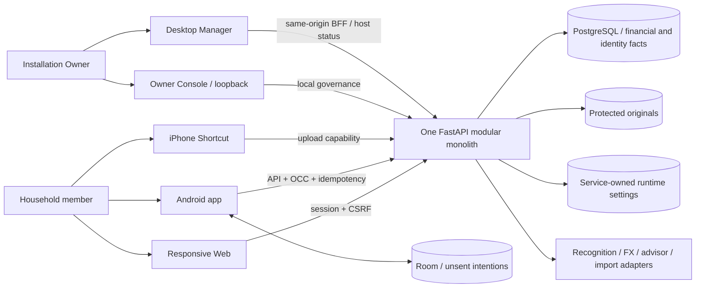

# Ticketbox current product atlas

This map answers **what the system is, where it stands, and what remains**.
Authority is the Goal and latest user rulings → three final Gmail contracts →
exact current code/database/build/runtime. This document is derived navigation,
not an independent product authority or an Internal Beta readiness claim.

**Standing standard for the entire Goal:** “允许问题域复杂，不允许复杂性在代码里到处扩散。”
ACK loss, OCC, binding changes, offline recovery and cross-client consistency
remain necessary. Explicit owners and stable contracts must reduce the places
that change together. This applies to implementation and documentation, through
compaction and final integration.

The atlas owns boundaries, capability status, remaining delivery and next action.
The [user journey contract](TICKETBOX_USER_JOURNEYS_CONTRACT.md) owns detailed task
semantics; linked slice contracts and plans own impact closure and qualification.
Maintain these by replacing stale current statements, repairing references and
retiring superseded instructions. Keep only information needed for the document's
responsibility; adding another paragraph is not a substitute for updating it.
[Earlier qualification notes](../qualification/2026-09-07-product-atlas-history.md)
are a frozen historical extraction. Candidate/main hashes, run IDs, test counts,
RED/GREEN narratives and review dispositions belong in those evidence sources,
not here. Reverify affected map entries when their implementation changes.

## 1. Five domains and their consumers

Web, Android, Shortcut, Owner Console and Desktop Manager are consumers with
different trust and interaction boundaries. They share one backend and one set
of fact/command/query owners. Adapters are replaceable tools; the application
owns permission, financial meaning and receipts. These are responsibility
boundaries within the modular monolith, not a microservice construction plan.

| Product domain | User task | Authoritative responsibility |
|---|---|---|
| Capture / Inbox | Capture or import, review suggestions, recover a remainder, confirm | Upload, import and Expense commands; protected originals and provenance |
| Transactions / Facts | Search and inspect confirmed records, correct facts, follow references | Financial facts, revisions and offsets; canonical query and correction owners |
| Relationships | Understand debts/splits/reimbursements, settle or correct an obligation | Relationship commands, lineage and derived totals |
| Planning | Set budgets/goals, manage recurring and income plans, associate actual payments | Planning commands and their links to confirmed facts; a plan is not a payment |
| Insights | Review periods, trends and projections; act on data-health results | Read models derived from authoritative facts, with exact navigation back to them |

Attachments and the reference library support Capture, Facts and Planning. Work
crosses domains through these existing owners; a report, suggestion or client
projection must not become a second financial authority.

## 2. Backstage and capability readiness

Backstage makes the five domains configurable, observable and recoverable. It is
not a second household product navigation. A tool is usable only through the
applicable chain: **configured → enabled → reachable → operable → observable**.
Valid configuration alone proves neither reachability nor successful execution.

| Responsibility | Owner / consumer | Boundary |
|---|---|---|
| Ledger and business preferences | Domain service → Web / Android | Available where the household performs the task |
| Safe live operator settings | Service-owned runtime projection → Owner Console | One validated atomic save, with observable effect |
| Identity, permissions and local governance | Identity / membership owners → all lawful entries | Backend enforces Account, Device, ledger and current role; loopback is not identity |
| Task and provider health | Existing worker, scheduler and provider owners → Owner / task consumer | Separate configuration, worker liveness and actual outcomes; readable recovery |
| Secrets, database, services and installation boundary | Windows lifecycle → Desktop Manager / read-only diagnostics | No casual Web toggle or alternate host writer |
| Public connectivity | Existing connectivity adapter → Backstage status | Configured endpoint and tunnel health do not establish Ticketbox usability |
| Backup / restore adapters | Windows lifecycle | Existing code does not open the held lifecycle program |

Runtime projection files, raw paths and route inventories are implementation
details. Prefer ordinary task health and a useful recovery action; retire
replaced developer surfaces when their real consumers migrate.

## 3. Shared boundaries

| Foundation | Rule for every affected journey |
|---|---|
| Identity and household | Reuse backend Account/Device, membership and ledger scope; no page-local authorization |
| Money and time | Preserve minor units, original/home currency, binding, intended dates/months and revisions; ambiguity needs a reachable recovery task |
| OCC, idempotency and acknowledgement | Preserve original binding/key/body and the applicable OCC; distinguish refusal, uncertain submission and canonical success |
| Offline intentions | Android enqueue, dispatcher, label, settlement and recovery move together; a local receipt is not a server fact |
| Attachments and recognition | Keep protected originals and provenance; suggestions remain drafts until explicit confirmation |
| Background work | Report queued/running/failed/succeeded honestly and preserve recoverable work; no endless spinner without a result |
| Client feedback | Preserve drafts on conflict/refusal; a successful command stays successful when a later query refresh fails, with separate refresh retry |
| Presentation | Share product meaning and semantic tokens without forcing identical layouts; retire replaced component, CSS and asset owners |

Before and after each business-semantic or owner change, record the impact in
its slice contract: **all entries, consumers, old success exits, persistence,
protocol/recovery paths and direct verification producers**. An unaffected claim
needs source or execution evidence. Unknown impact remains open. Use the
smallest sufficient TDD/gate map, bounded FIX/REJECT/HOLD review and exact-source
cloud qualification; local tests must stay short. Auditing verifies the product
and does not define it.

## 4. Capability status

`EXISTING` means present, with integrated usability still to establish;
`STRONG_SLICE` means a bounded task is integrated and qualified, not the whole
product. `PARTIAL` requires completion, `RETIRED` must stay retired, and `HOLD`
requires its stated reactivation condition. `CLOSED` applies only to the named
slice. Full Internal Beta RC completion is still outstanding.

| Capability | State and current boundary | Detail / evidence |
|---|---|---|
| Upload links, Shortcut and pending review | `STRONG_SLICE`; #385 and #387 CLOSED, integrated and main-qualified. Real-device recovery, review completion, retained drafts and original access passed | [Upload contract](TICKETBOX_UPLOAD_INTENT_CONTINUITY_CONTRACT.md), [#387](https://github.com/xxu29958-jpg/xpj/pull/387) |
| Batch import through confirmation | `PARTIAL`; batch remainder and saved CSV continuation are integrated. Historical foreign-currency imports still cannot trigger the missing dated reference rates; successful latest-rate sync does not make those bills confirmable | [Batch](TICKETBOX_CAPTURE_BATCH_CONTINUATION_CONTRACT.md), [CSV](TICKETBOX_CSV_IMPORT_CONTINUATION_CONTRACT.md), [FX recovery](TICKETBOX_USER_JOURNEYS_CONTRACT.md#missing-fx-rate-recovery) |
| Confirmed facts and composite correction | `STRONG_SLICE`; #382 CLOSED, durable correction owner integrated and main-qualified; actual OS interruption remains to rehearse | [Correction contract](TICKETBOX_EXPENSE_CORRECTION_CONTINUITY_CONTRACT.md) |
| Recognition and assisted entry | `STRONG_SLICE`; #353 CLOSED. Shared configured suggestions remain drafts. Debt image/binding continuity #386 CLOSED, integrated and main-qualified | [Journeys](TICKETBOX_USER_JOURNEYS_CONTRACT.md#recognition-and-assisted-entry), [Debt image contract](TICKETBOX_DEBT_BILL_BINDING_CONTRACT.md) |
| Currency choice and correction | `PARTIAL`; #397 CLOSED, explicit choice, changeable defaults and recorded-money consumers are integrated and main-qualified. Historical FX correction continuation #399 is also integrated and main-qualified | [Currency contract](TICKETBOX_CURRENCY_CHOICE_CORRECTION_CONTRACT.md) |
| One-bill manual FX recovery | `STRONG_SLICE`; #355 CLOSED. Shared pending Expense editor, canonical review and Android PatchExpense intent | [FX journey](TICKETBOX_USER_JOURNEYS_CONTRACT.md#missing-fx-rate-recovery) |
| Historical correction FX continuation | `STRONG_SLICE`; #399 CLOSED. Exact pair/date, independent rate save and original correction continuation are integrated and main-qualified | [Historical FX](TICKETBOX_HISTORICAL_FX_CONTINUATION_CONTRACT.md) |
| Manual expense and browser draft | `STRONG_SLICE`; #398 CLOSED. Durable admission, original receipt replay and visible submission continuation are integrated and independently main-qualified; remaining cross-client interruption rehearsal stays in delivery | [Manual continuity](TICKETBOX_MANUAL_CREATION_CONTINUITY_CONTRACT.md), [Manual entry](TICKETBOX_USER_JOURNEYS_CONTRACT.md#manual-expense-entry) |
| External debt, split and reimbursement | `PARTIAL`; split acceptance, member settlement and adjustment owners are integrated. Direct repayment still lacks durable original-submission recovery on Android/Web; re-entering after an unknown result can create a second payment | [Debt context](TICKETBOX_USER_JOURNEYS_CONTRACT.md#external-debt-context), [Adjustment](TICKETBOX_DEBT_ADJUSTMENT_CONTINUITY_CONTRACT.md) |
| Android external-debt creation and recovery | `STRONG_SLICE`; #369/#370 CLOSED. Original submitted intent and readable retry/discard; keyboard, OS interruption and unsubmitted editing restoration remain | [Convenience plan](../superpowers/plans/2026-09-05-consumer-art-convenience.md) |
| Debt adjustment continuity | `STRONG_SLICE`; #379 CLOSED. Sole dispatcher preserves original submission and refreshes affected consumers | [Adjustment contract](TICKETBOX_DEBT_ADJUSTMENT_CONTINUITY_CONTRACT.md) |
| Budgets and goals | `PARTIAL`; compact first use, accurate feedback and durable Goal reads are main-qualified. Budget/debt query persistence, unsubmitted goal drafts and complete cross-client refresh remain | [Budget journey](TICKETBOX_USER_JOURNEYS_CONTRACT.md#budget-first-step), [Goal reads](TICKETBOX_GOAL_OFFLINE_READING_CONTRACT.md) |
| Fixed commitments through actual payment | `PARTIAL`; occurrence association and removal of fulfilled reserves are integrated. Existing cross-currency valuation has no usable foreign-currency creation flow; recording a missing payment cannot return directly to the original period for association | [Recurring](TICKETBOX_RECURRING_OCCURRENCE_CONTRACT.md) |
| Income planning | `STRONG_SLICE`; server-month revision and original submitted recovery are integrated; plans remain forecasts. Unsubmitted create/edit drafts still need interruption recovery | [Income plans](TICKETBOX_INCOME_PLAN_CONTRACT.md) |
| Period review and explainable export | `PARTIAL`; canonical fact navigation and shared reports exist. Default accounting-time scope differs across clients; CSV refund/reversal rows omit their stored frozen FX evidence | [Insight navigation](TICKETBOX_INSIGHT_FACT_NAVIGATION_CONTRACT.md), [Journeys](TICKETBOX_USER_JOURNEYS_CONTRACT.md) |
| First use, connection and household entry | `STRONG_SLICE`; invitation, real local Web identity and #378 original-code continuation integrated; full Owner/member/viewer rehearsal remains | [Household journeys](TICKETBOX_USER_JOURNEYS_CONTRACT.md#household-invitation), [Desktop first use](TICKETBOX_DESKTOP_FIRST_USE_CONTRACT.md) |
| Recycle recovery | `STRONG_SLICE`; #375 CLOSED. Canonical Web query/dispatcher owns business restore; duplicate Owner surface retired; ledger governance restore remains local | [Recycle journey](TICKETBOX_USER_JOURNEYS_CONTRACT.md#recycle-recovery) |
| Public admin exposure | `RETIRED`; #383 CLOSED. Local governance boundary integrated and main-qualified; lawful remote ledger consumers remain | [Governance contract](TICKETBOX_LOCAL_GOVERNANCE_BOUNDARY_CONTRACT.md) |
| Advisor readiness and FX worker recovery | `STRONG_SLICE`; #376/#374 CLOSED. Existing factory/consent/role and worker/lease owners; configuration and observed results stay distinct | [Migrated evidence](../qualification/2026-09-07-product-atlas-history.md) |
| Runtime diagnostics and task recovery | `PARTIAL`; original-bill continuation and ordinary connection recovery are integrated. Recognition settings/diagnostics still expose configuration without a recent execution result or its task continuation | [#389](https://github.com/xxu29958-jpg/xpj/pull/389), Backstage delivery below |
| Durable offline financial reads | `PARTIAL`; expense/statistics storage exists. Goal list/detail reopening and explicit-access-refusal handling #401 are integrated and main-qualified; budget and debt query persistence remain. Page memory, drafts and command receipts do not prove offline query coverage | [Goal read contract](TICKETBOX_GOAL_OFFLINE_READING_CONTRACT.md) |
| Android offline publication across mutation families | `STRONG_SLICE`; preserve dispatcher/label coverage, original context and explicit recovery; never show raw keys or silently discard intent | Cross-client delivery below and affected slice contracts |
| Consumer visual art and convenience | `PARTIAL`; selected art/frame/forms integrated. Full consumer art and real cross-screen interaction acceptance remain required | [Art / convenience plan](../superpowers/plans/2026-09-05-consumer-art-convenience.md) |
| Windows Fresh G2 | `CLOSED`; preserve qualification boundary | Executable current-product counterexample required to reopen minimal host work |
| Complete Windows lifecycle | `HOLD`; repair, preserved reinstall, complete uninstall, upgrade/downgrade, complete backup/restore and Cut C/D/E | Outside current delivery; no implicit lifecycle claim |

## 5. Remaining delivery packages

These are the finite packages of the same full Goal, assessed by complete daily
tasks across the five domains and Backstage. A closed mechanism is evidence for
that part of a journey, not proof of the entire capability. Source-confirmed gaps
below still require direct counterexamples before construction; unverified runtime
or visual quality remains qualification work, not a claimed missing feature.

| Package | Remaining user outcome / exit |
|---|---|
| First use and household | Rehearse the integrated explicit currency choice and changeable defaults, household admission, roles and connection recovery. Make default accounting time discoverable and shared across clients without reinterpreting recorded facts |
| Capture, facts and reference | Complete historical foreign-bill import through dated reference-rate acquisition, visible pending/retry and human confirmation. Manual creation and historical correction recovery are already integrated. Rehearse search, reference maintenance and correction through their real entries |
| Relationships | Recover original direct repayments after ACK loss/restart, then qualify settlement through debt balances, goal progress and history. Preserve integrated split/member settlement and adjustment owners; retire the direct per-call new-intent writer |
| Planning and insights | Express a foreign fixed commitment, understand its budget valuation, record actual payment and return to the original period to associate it. Retained views must reflect accepted facts; period queries and refund/reversal exports must explain the same recorded money/time |
| Backstage | Surface recent recognition execution and its existing task continuation alongside configuration. Keep Advisor readiness, ordinary connection recovery and original-bill task recovery; do not build another health/configuration system |
| Consumer art and convenience | Actual Web 360/768/1440 and Android journeys meet the selected modern consumer design and reduce interaction burden; retire replaced visual owners. Replace raw split-source metadata; resolve the observed intermittent first bottom-navigation tap |
| Cross-client continuity and data safety | Refresh actual queries when returning after another client changed facts; persist applicable budget/debt reads and raw unsubmitted planning drafts. Rehearse role/revocation, token rotation, ledger switch, OS interruption, conflict/quarantine, originals and supported export; receipts and page memory are not query snapshots |
| Exact RC freeze and delivery | Freeze final main/tree, Setup/APK and manifests; complete clean-Windows ordinary product and cross-client/reboot/data/identity rehearsal; publish accepted non-blocking limits and unchanged Windows HOLDs |

Visual delivery includes coherent icons/illustrations/empty states/backgrounds
and textures, typography, color, hierarchy, controls, focus/motion and light/dark
appearance. Custom backgrounds must work across applicable surfaces. Existing
Paper/Midnight UI and the Owner reference photo are not design authority; the
rejected green-hat direction must not return. Defaults, shortcuts, keyboard/touch,
batches, fewer repeated inputs/page transitions and recoverable drafts are user
outcomes. Inspect real tasks and states, not just assets, tokens or screenshots.

Restore-dependent identity limitations remain explicitly HOLD:
[local Web expected preview identity and Android unbound invitation generation](TICKETBOX_USER_JOURNEYS_CONTRACT.md#restore-dependent-identity-holds).
Do not drop these or open full lifecycle work while handling other journeys.

## 6. Construction order and next action

**Priority:** whole-system horizontal and vertical capability gaps first, then
remaining art/interaction details, then the exact full RC. Keep useful state
feedback and efficient actions within each active capability change.

**Active work:** #385–#396 are CLOSED, integrated and independently main-qualified.
[Member settlement evidence](TICKETBOX_MEMBER_SETTLEMENT_CONTINUITY_CONTRACT.md).
[Spending-goal continuity evidence](TICKETBOX_PLANNING_GOAL_CONTINUITY_CONTRACT.md).

**#402 CLOSED:** [financial read propagation](TICKETBOX_FINANCIAL_READ_PROPAGATION_CONTRACT.md) is integrated and main-qualified.

**Next action:** close [direct repayment recovery](TICKETBOX_DIRECT_REPAYMENT_CONTINUITY_CONTRACT.md) across its real Android and Web entries. Continue the
historical foreign-bill and fixed-commitment journeys, shared accounting-time and
complete export, then remaining read/draft/Backstage continuity. Select each
bounded change from these full user outcomes; an isolated semantic fix, working
API or green test never closes its entire delivery package. Reuse sufficient
owners and physically retire replaced paths. Assess visual/interaction results
through real tasks after the capability gaps, before the final RC rehearsal.
Preserve draft #372 for the later detail wave.
The full Goal and all remaining packages above stay active.

After a slice's agreed user postcondition, targeted regression, bounded review
and exact-source qualification are satisfied, close it and proceed. Keep other
real gaps in their package. Cosmetic alternatives, speculative abstractions,
redundant tests and unsupported-platform matrices do not delay RC; a missing
required task, data/identity/intent risk or required final evidence does.
