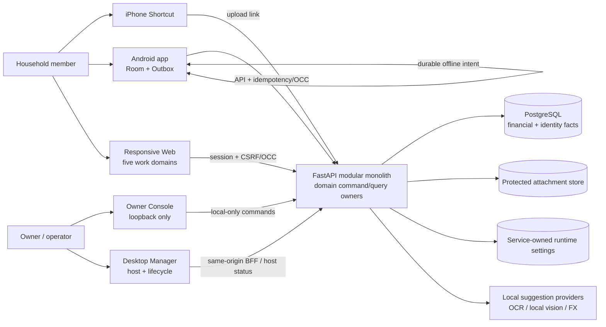
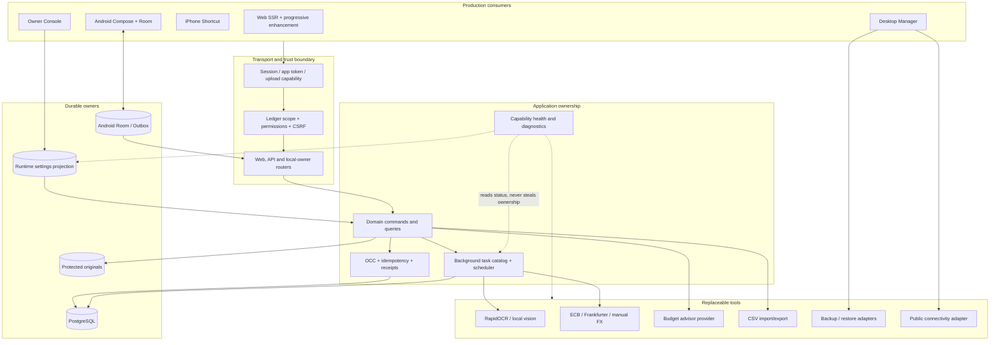
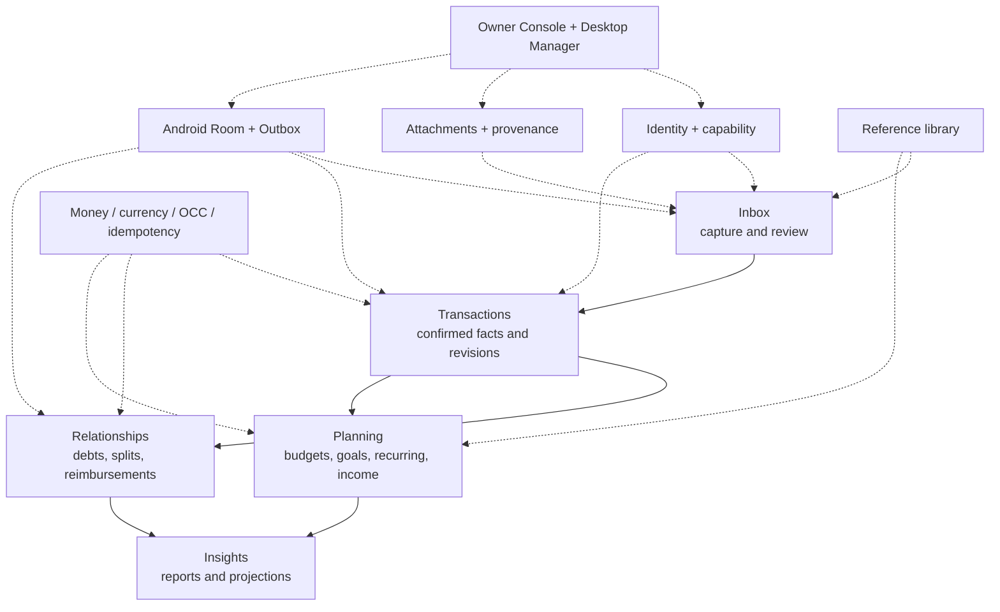
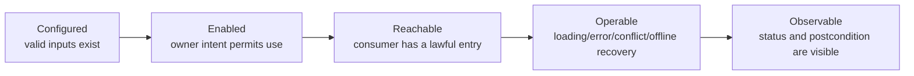
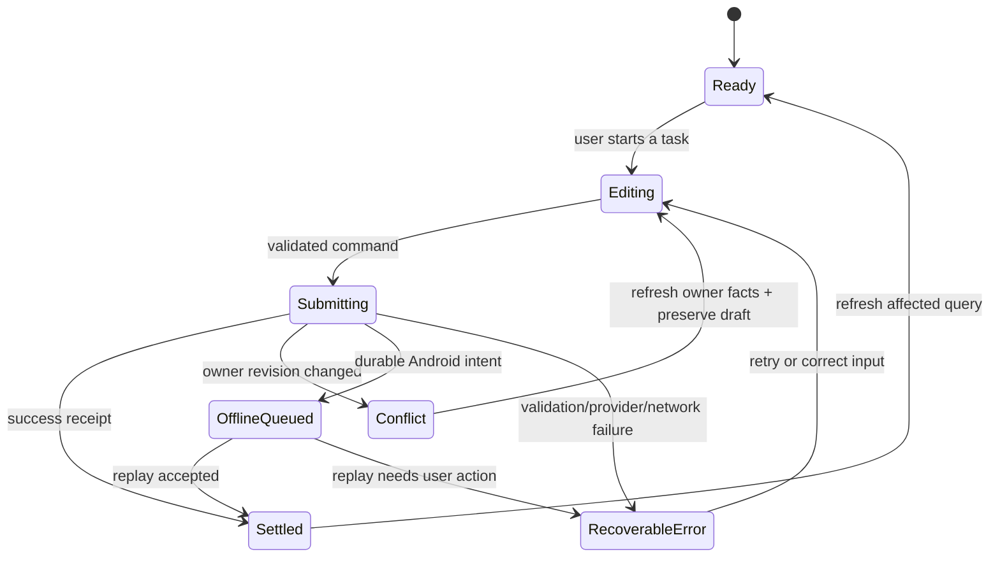
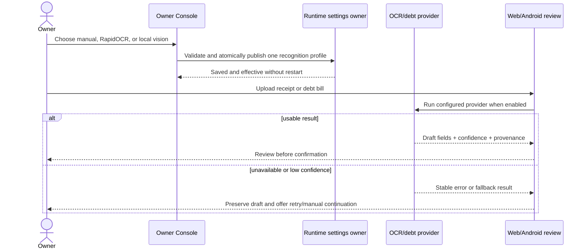
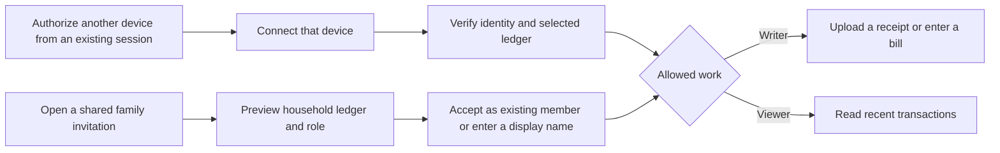

# Ticketbox current product atlas

> Derived implementation map, not a product authority. The authoritative subject is the Git commit that contains this file. Reverify after changes to registered routes, domain services, runtime settings, Room/Outbox, Desktop Manager, packaging, or consumer navigation.

This atlas turns the three 2026-08-26 contracts into a current construction map. It records what exists, what is only partially usable, what is genuinely missing, and what must retire. `COMPLETE` is intentionally absent until exact Internal Beta RC qualification.

## 1. Product and container architecture



There is one backend runtime and one set of fact owners. Web, Android, Owner Console, Desktop Manager and Shortcut are consumers with different trust and interaction boundaries; none may become a second business owner.

### Runtime lanes and tool boundaries



The containers above are responsibilities, not a request to split the modular monolith into services. Adapters may change; commands, permissions, facts and user receipts remain owned by the application layer. A tool is not a product capability until a real consumer can configure or reach it, recover from failure, and observe the postcondition.

## 2. User work and backstage



The five domains are the product. Backstage exists to make them installable, configurable, observable and recoverable; it is not a second product navigation.

## 3. Capability control boundary

Every capability is evaluated through the same five links:



| Setting kind | Fact owner | Product surface | Rule |
|---|---|---|---|
| Ledger/business preference | Domain service | Web and Android | Available where the household performs the task |
| Safe live operator setting | Service-owned runtime projection | Owner Console | Atomic save, validated, immediately observable |
| Secret, database, service or install boundary | Windows lifecycle | Desktop Manager or read-only diagnostics | Never exposed as a casual web toggle |
| Internal maintenance policy | Owning service/scheduler | Health/status first | Add a manual control only for a real recovery task |

This replaces the old advice to edit the runtime projection or `backend/.env` from a web page. The projection is an implementation detail; lifecycle-owned settings stay lifecycle-owned.

## 4. Current capability classification

| Capability | State | Current owner and consumers | Required disposition |
|---|---|---|---|
| Upload links, Shortcut capture and pending review | `EXISTING` | Upload/expense services → Shortcut, Web, Android, Owner | Preserve and improve task feedback |
| Confirmed financial facts, revisions and offsets | `STRONG_SLICE` | Financial fact services → Web and Android | Keep exact OCC/revision semantics; RC qualification remains |
| Debts, splits and reimbursements | `STRONG_SLICE` | Relationship services → Web and Android | Preserve offline intent and lineage |
| Budgets, goals, recurring and income plans | `STRONG_SLICE` | Planning services → Web and Android | Continue consumer-level completion and visual migration |
| Reports, trends and projections | `STRONG_SLICE` | Insight read models → Web and Android | Continue information hierarchy and empty/error work |
| Receipt and debt-bill recognition | `STRONG_SLICE`, merged in #353 | OCR/debt parse services → upload/review/debt consumers | Preserve Owner selection, enablement and shared-pipeline status; full product RC qualification remains |
| Currency adoption when existing evidence requires it | `STRONG_SLICE`, merged in #354 at `684c0dd8` | Installation binding/adoption service → Desktop product bridge; Android compatibility guard | Candidate and exact merge-main cloud qualification passed; keep old maintenance API retired |
| Manual FX recovery for one pending foreign-currency expense | `PARTIAL` in this candidate | Expense snapshot owner → same pending PATCH, Web edit and Android PatchExpense | Qualify same-page review, replay and offline intent; the previous atlas incorrectly called the single-bill command existing |
| First use, connection and household entry | `PARTIAL` / under current verification | Installation/account/ledger owners → Desktop, Web and Android | Simplify the role-specific first-use journey, explain data ownership, preserve entered setup and provide one actionable recovery step |
| Recycle bin | `DUPLICATE` | Web recycle owner plus narrower Owner Console implementation | Promote the complete Web journey; retire the duplicate Owner writer/surface |
| Public admin API exposure | `DORMANT` / `RETIRE` | Backend route group, no product consumer | Keep local maintenance boundary or remove exposure toggle; do not invent a UI consumer |
| AI advisor | `PARTIAL` | Advisor service + consent UI → Web/Owner | Provider secrets remain lifecycle-owned; surface readiness and missing setup honestly |
| FX sync and maintenance schedulers | `PARTIAL` backstage | Scheduler/service → status and selected manual actions | Add control only where an operator must make a product decision; otherwise expose health |
| Runtime diagnostics | `EXISTING` but developer-heavy | Backend/Owner/Desktop | Replace raw paths/route inventory with task-oriented health, then retire developer surfaces |
| Android offline mutation publication | `STRONG_SLICE` | Room Outbox → registered dispatchers → backend owners | Preserve full mutation-type/label/dispatcher coverage |
| Windows Fresh G2 | `CLOSED` | Windows lifecycle | Do not reopen without an executable product counterexample |
| Restore, upgrade/downgrade and complete lifecycle operations | `HOLD` | Windows lifecycle | Remain outside current product construction |

### Horizontal foundation coverage

| Foundation | Current reality | Strengthening rule |
|---|---|---|
| Identity and household authority | Account, ledger membership, devices, invitations and session lineage exist | Every new journey reuses permission and ledger scope; no page-local authorization |
| Money meaning | Minor units, original/home currency, binding and revision facts exist | Block ambiguous writes, but always provide a reachable recovery journey |
| Concurrency and replay | Row OCC and idempotent commands exist on fact-changing paths | Preserve drafts on conflict; refresh owner facts before retry; do not bind command eligibility to a failed list query |
| Offline delivery | Android Room/Outbox dispatch coverage exists | Every new Android mutation needs enqueue, dispatcher, label, settlement and recovery together |
| Attachments and provenance | Protected originals, thumbnails and OCR facts exist | Suggestions stay drafts; confirmation owns the financial fact |
| Background work | Task catalog, leases and schedulers exist | Surface queued/running/failed/succeeded truth where the user waits; no spinner without settlement |
| Runtime capability control | Public URL and recognition groups are service-owned | Safe live settings use one atomic grouped command; secrets and install boundaries remain lifecycle-owned |
| Diagnostics and recovery | Owner/Desktop diagnostics and maintenance actions exist | Prefer task health and one recovery action over raw paths, route dumps and implementation jargon |
| Presentation system | Shared Web/Android semantic tokens and responsive shells exist | Migrate real journeys without capability loss; remove old component/CSS owners as consumers move |

### Common user-operation state model



Screens may express these states differently, but they may not collapse them into one generic failure. A successful command remains successful even when the following query refresh fails; the UI shows the receipt and offers a separate refresh retry.

## 5. Corrected operation journeys

### Recognition and assisted entry



### Currency adoption

```mermaid
sequenceDiagram
    actor O as Installation Owner
    participant D as Desktop product bridge
    participant C as Currency adoption service
    participant B as Installation binding + audit
    participant A as Android Outbox worker
    O->>D: Open any money page
    D->>C: Read adoption preview as paired Desktop owner
    C-->>D: Evidence conclusion + binding revision
    D-->>O: Explain one-time choice and consequences
    O->>D: Confirm original home currency
    D->>C: Form command + evidence token + OCC + idempotency
    C->>B: Lock, revalidate owner/evidence, activate once
    B-->>C: Durable receipt + audit actor
    C-->>D: Active binding
    D-->>O: Money features restored
    A->>C: Read runtime compatibility before drain
    alt compatible
        C-->>A: compatible + API version + currency binding
        A->>C: Replay existing durable intents with negotiated headers
    else adoption still required or read unavailable
        C-->>A: owner action required / unavailable
        A-->>A: Preserve rows; show Owner action when required; retry later
    end
```

The installation claim account is the authority; the browser form is only its Desktop consumer. A naked browser, a different account and the retired maintenance API cannot adopt. Evidence conflicts keep every amount unchanged and route the Owner to the existing Desktop diagnostics shortcut. Android reads the shared compatibility conclusion before draining and shows the installation Owner's next step in Sync Status. Immediate and queued writes negotiate the current API version and currency binding. A failed negotiation read or a binding activation race remains retryable, preserving the queued intent.

### Missing FX rate recovery

1. Pending review identifies the original currency/date and says why confirmation is blocked.
2. The original Web and Android editors accept `1 original currency = N home currency`, explicitly for this bill only. A member can correct an entered rate before confirming.
3. The existing pending edit command applies the rate and any edited amount/date in one Expense OCC/idempotency transaction. The backend records the manual source and effective transaction date, computes the home amount, and returns a still-pending bill. It never writes the shared daily ExchangeRate table for this task.
4. The editor stays open to show the canonical conversion before the user confirms. Browser and Android do not create a competing FX calculator or treat an unreviewed local estimate as ready.
5. Android queues the rate with the existing PatchExpense intent when offline. It explains that conversion awaits synchronization; ordinary already-ready offline confirmation remains available.
6. Validation failure, conflict and response loss preserve the complete draft and stable retry identity. Web and API share the edit transaction owner; the old Web direct-commit bypass retires as its consumers move.

The previous map confused an existing ledger-wide manual daily-rate endpoint with an existing single-bill recovery command. Current code established that distinction; the product task determines the new scope. Shared-rate administration and provider ingestion are not silently coupled to editing one bill.

Current-slice evidence (revisit on the listed paths or a direct failing journey; retain only the load-bearing regression after this slice):

| Claim and falsifier | Owner / consumers and trigger paths | Evidence and cost |
|---|---|---|
| Rate recovery remains pending, affects only one bill, and cannot overwrite stale facts; falsified by shared-rate mutation, early confirmation or stale overwrite | Expense snapshot + pending PATCH; schemas, currency/update services | Focused real PostgreSQL command journey; seconds locally, full PG on exact cloud candidate |
| A user reviews the conversion without leaving the task; response loss cannot duplicate or lose the save | Shared edit command + Web full/drawer forms; edit routes/templates | Real authenticated form submission, idempotent replay and draft/error responses; focused local PG |
| Offline save retains the rate intent without invented ready money | Android DTO/draft, PatchExpense and edit ViewModel/screen | Focused JVM payload, queue and settlement tests; connected execution on exact cloud candidate |
| The public wire contract matches every changed consumer | API schema / Android DTOs | Generated OpenAPI check plus exact-head Backend/Android/Connected qualification; no new permanent audit registry |

### Recycle recovery

The complete Web recycle journey becomes the only product owner for list/restore. Owner Console links to that journey for operator convenience; its narrower duplicate query/restore implementation is physically retired.

### First use and binding — next independent slice, not yet implemented

The verified `684c0dd8` baseline has working Account/Device/Member/Invitation/Session owners, Android durable enrollment and Desktop credential storage. The user journey is incomplete: Web login asks family members to obtain an Owner pairing code, but Owner pairing authorizes an additional device for the Owner's existing identity. The actual family invitation page sends new members to Android. A browser-only new member therefore lacks a direct invitation/enrollment consumer.

Android also asks already-authenticated members for account/device names which the existing-session acceptance branch does not consume. Its invite screen uses non-restorable local inputs although the preview survives in its ViewModel. These are real task costs, not missing backend identities.



Selected next task: complete family invitation handoff on Web and Android using existing enrollment/session owners. The entry itself carries intent; users do not choose a technical pairing/invitation category. Share the server location and invitation together, default device identity, ask a new person only for a display name, remove redundant authenticated-name fields, show destination/role before acceptance and keep failure recovery in the same task. Invitation secrets must not become analytics, referrer or diagnostic data. Exact link/QR transport and replay handling still require implementation-level design; this diagram is a target, not a shipped guarantee.

Desktop first-use explanation, expired-code recovery links and Web manual entry remain recorded companion gaps. They do not authorize reopening installer, account recovery, upgrades or other Windows HOLD work.

## 6. Construction order

1. **Recognition control:** close configured → enabled → observable for receipt and debt-bill recognition in the existing runtime-settings owner.
2. **Currency adoption ceremony:** unblock an installation that otherwise cannot perform any money write.
3. **Pending FX recovery:** complete a single-bill edit/preview/confirm journey across Web and Android.
4. **First use and binding:** verify and simplify the role-specific connection, identity, ledger and first-entry journey, without reopening Windows lifecycle.
5. **Backstage consolidation:** retire duplicate recycle/admin/developer surfaces and replace raw implementation detail with task health.
6. Return to the five domains, select the highest user-value `PARTIAL` or `MISSING` chain, and repeat until exact RC.

Each slice stops after its frozen user postcondition is true, targeted regression passes, and exact-head cloud evidence has a disposition. Neighboring gaps remain in this goal map, with the owning journey and a reactivation step, rather than disappearing through repeated HOLD decisions. Fewer repeated inputs, fewer unnecessary page transitions, clear keyboard/touch actions and recoverable drafts are product outcomes, not optional finishing polish.
