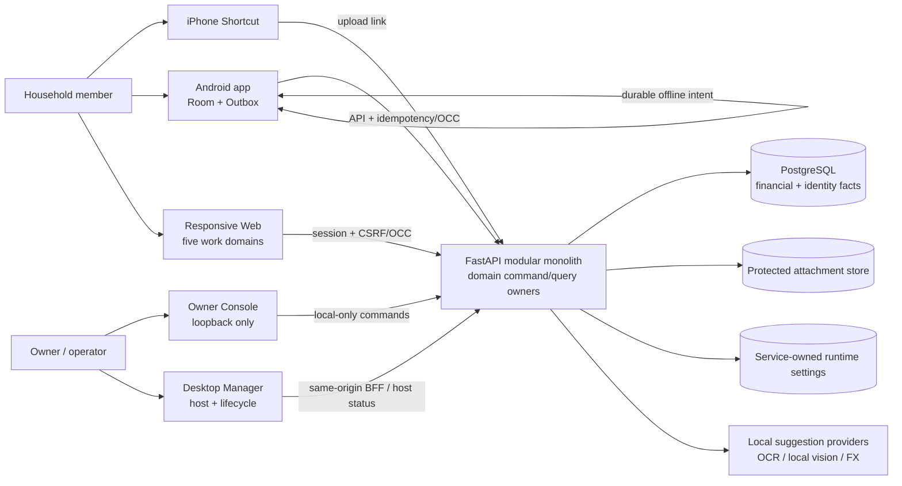
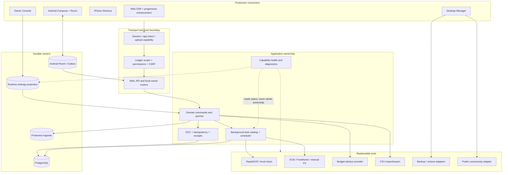
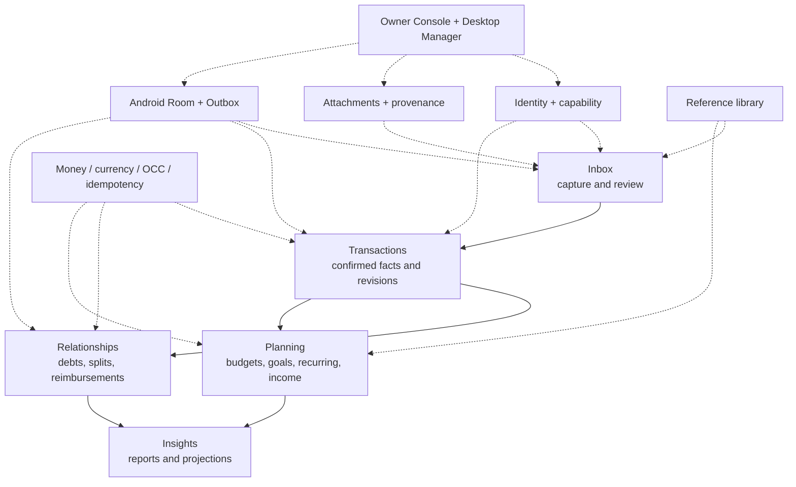
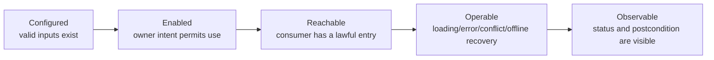
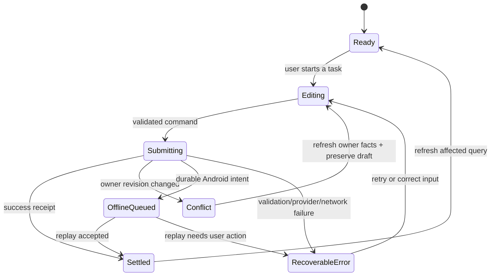
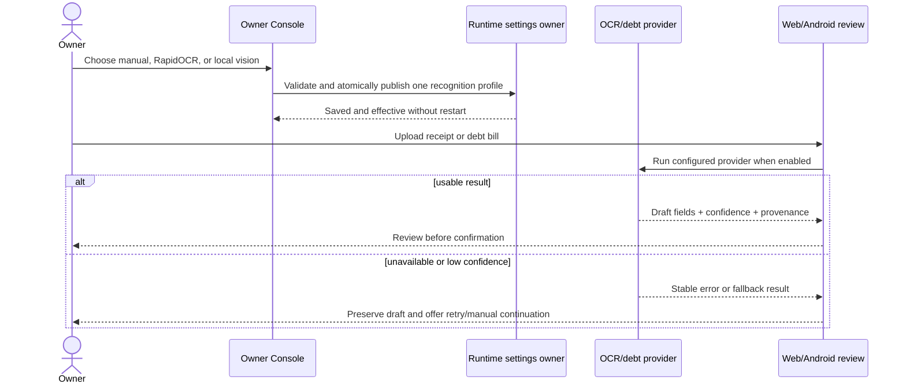

# Ticketbox current product atlas

> Derived implementation map, not a product authority. The authoritative subject is the Git commit that contains this file. Reverify after changes to registered routes, domain services, runtime settings, Room/Outbox, Desktop Manager, packaging, or consumer navigation.

This atlas turns the three 2026-08-26 contracts into a current construction map. It records what exists, what is only partially usable, what is genuinely missing, and what must retire. `COMPLETE` is intentionally absent until exact Internal Beta RC qualification.

## 1. Product and container architecture

There is one backend runtime and one set of fact owners. Web, Android, Owner Console, Desktop Manager and Shortcut are consumers with different trust and interaction boundaries; none may become a second business owner.

### Runtime lanes and tool boundaries

The containers above are responsibilities, not a request to split the modular monolith into services. Adapters may change; commands, permissions, facts and user receipts remain owned by the application layer. A tool is not a product capability until a real consumer can configure or reach it, recover from failure, and observe the postcondition.

## 2. User work and backstage

The five domains are the product. Backstage exists to make them installable, configurable, observable and recoverable; it is not a second product navigation.

## 3. Capability control boundary

Every capability is evaluated through the same five links:

| Setting kind | Fact owner | Product surface | Rule |
|---|---|---|---|
| Ledger/business preference | Domain service | Web and Android | Available where the household performs the task |
| Safe live operator setting | Service-owned runtime projection | Owner Console | Atomic save, validated, immediately observable |
| Secret, database, service or install boundary | Windows lifecycle | Desktop Manager or read-only diagnostics | Never exposed as a casual web toggle |
| Internal maintenance policy | Owning service/scheduler | Health/status first | Add a manual control only for a real recovery task |

This replaces the old advice to edit the runtime projection or `backend/.env` from a web page. The projection is an implementation detail; lifecycle-owned settings stay lifecycle-owned.

## 4. Current capability classification

| Capability | State | Current owner and consumers | Required disposition |
|---|---|---|---|
| Upload links, Shortcut capture and pending review | `EXISTING` | Upload/expense services → Shortcut, Web, Android, Owner | Preserve and improve task feedback |
| Confirmed financial facts, revisions and offsets | `STRONG_SLICE` | Financial fact services → Web and Android | Keep exact OCC/revision semantics; RC qualification remains |
| Debts, splits and reimbursements | `STRONG_SLICE` | Relationship services → Web and Android | Preserve offline intent and lineage |
| Budgets, goals, recurring and income plans | `STRONG_SLICE` | Planning services → Web and Android | Continue consumer-level completion and visual migration |
| Reports, trends and projections | `STRONG_SLICE` | Insight read models → Web and Android | Continue information hierarchy and empty/error work |
| Receipt and debt-bill recognition | `PARTIAL` on baseline; strengthened by this slice | OCR/debt parse services → upload/review/debt consumers | Owner must be able to select, enable and observe the shared local pipeline |
| Currency adoption when existing evidence requires it | `MISSING` consumer ceremony | Currency adoption service/API → no supported product entry | Add one Owner-led preview/confirm/recovery journey; do not duplicate the owner |
| Manual FX recovery for a pending foreign-currency expense | `SURFACE_ONLY` | Pending-expense command exists → no Web/Android editor field | Wire both real consumers to the existing command and truthful postcondition |
| Recycle bin | `DUPLICATE` | Web recycle owner plus narrower Owner Console implementation | Promote the complete Web journey; retire the duplicate Owner writer/surface |
| Public admin API exposure | `DORMANT` / `RETIRE` | Backend route group, no product consumer | Keep local maintenance boundary or remove exposure toggle; do not invent a UI consumer |
| AI advisor | `PARTIAL` | Advisor service + consent UI → Web/Owner | Provider secrets remain lifecycle-owned; surface readiness and missing setup honestly |
| FX sync and maintenance schedulers | `PARTIAL` backstage | Scheduler/service → status and selected manual actions | Add control only where an operator must make a product decision; otherwise expose health |
| Runtime diagnostics | `EXISTING` but developer-heavy | Backend/Owner/Desktop | Replace raw paths/route inventory with task-oriented health, then retire developer surfaces |
| Android offline mutation publication | `STRONG_SLICE` | Room Outbox → registered dispatchers → backend owners | Preserve full mutation-type/label/dispatcher coverage |
| Windows Fresh G2 | `CLOSED` | Windows lifecycle | Do not reopen without an executable product counterexample |
| Restore, upgrade/downgrade and complete lifecycle operations | `HOLD` | Windows lifecycle | Remain outside current product construction |

### Horizontal foundation coverage

| Foundation | Current reality | Strengthening rule |
|---|---|---|
| Identity and household authority | Account, ledger membership, devices, invitations and session lineage exist | Every new journey reuses permission and ledger scope; no page-local authorization |
| Money meaning | Minor units, original/home currency, binding and revision facts exist | Block ambiguous writes, but always provide a reachable recovery journey |
| Concurrency and replay | Row OCC and idempotent commands exist on fact-changing paths | Preserve drafts on conflict; refresh owner facts before retry; do not bind command eligibility to a failed list query |
| Offline delivery | Android Room/Outbox dispatch coverage exists | Every new Android mutation needs enqueue, dispatcher, label, settlement and recovery together |
| Attachments and provenance | Protected originals, thumbnails and OCR facts exist | Suggestions stay drafts; confirmation owns the financial fact |
| Background work | Task catalog, leases and schedulers exist | Surface queued/running/failed/succeeded truth where the user waits; no spinner without settlement |
| Runtime capability control | Public URL and recognition groups are service-owned | Safe live settings use one atomic grouped command; secrets and install boundaries remain lifecycle-owned |
| Diagnostics and recovery | Owner/Desktop diagnostics and maintenance actions exist | Prefer task health and one recovery action over raw paths, route dumps and implementation jargon |
| Presentation system | Shared Web/Android semantic tokens and responsive shells exist | Migrate real journeys without capability loss; remove old component/CSS owners as consumers move |

### Common user-operation state model

Screens may express these states differently, but they may not collapse them into one generic failure. A successful command remains successful even when the following query refresh fails; the UI shows the receipt and offers a separate refresh retry.

## 5. Corrected operation journeys

### Recognition and assisted entry

### Currency adoption

1. Any consumer receiving `currency_adoption_required` stops money writes without relabelling amounts.
2. It links the Owner to one local adoption screen.
3. The screen reads the service-owned preview: proposed home currency, evidence summary, revision and evidence hash.
4. Owner confirms once; the command carries OCC expectations and an idempotency key.
5. Success returns a receipt, consumers refresh the runtime compatibility envelope, and normal writes resume.
6. Conflict refreshes the preview; it never guesses a currency or creates a second binding owner.

### Missing FX rate recovery

1. Pending review identifies the original currency/date and says why confirmation is blocked.
2. Web and Android editors expose the existing manual-rate command in the same task, not a dead-end instruction.
3. Save validates the rate under the backend owner and refreshes the pending projection.
4. Confirmation becomes available only after the server returns a ready home-currency projection.
5. Failure preserves the user draft and distinguishes invalid input, stale revision and temporary sync failure.

### Recycle recovery

The complete Web recycle journey becomes the only product owner for list/restore. Owner Console links to that journey for operator convenience; its narrower duplicate query/restore implementation is physically retired.

## 6. Construction order

1. **Recognition control:** close configured → enabled → observable for receipt and debt-bill recognition in the existing runtime-settings owner.
2. **Currency adoption ceremony:** unblock an installation that otherwise cannot perform any money write.
3. **Pending FX recovery:** connect the already-owned manual-rate command to Web and Android.
4. **Backstage consolidation:** retire duplicate recycle/admin/developer surfaces and replace raw implementation detail with task health.
5. Return to the five domains, select the highest user-value `PARTIAL` or `MISSING` chain, and repeat until exact RC.

Each slice stops after its frozen user postcondition is true, targeted regression passes, and exact-head cloud evidence has a disposition. Neighboring improvements remain `HOLD` instead of extending review indefinitely.
