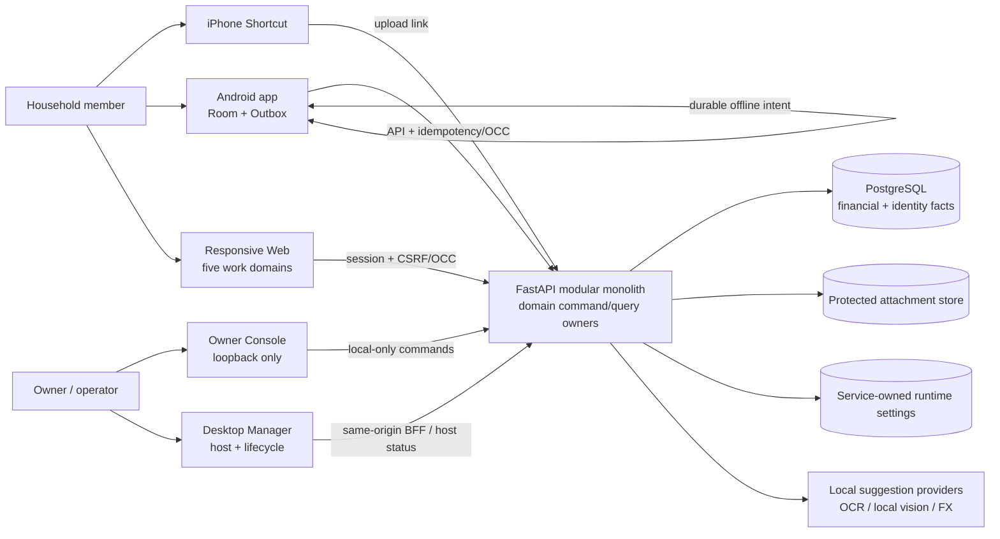
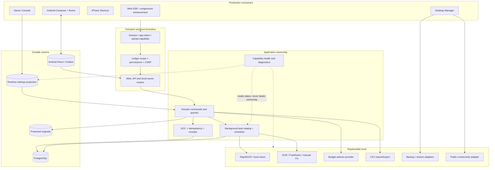
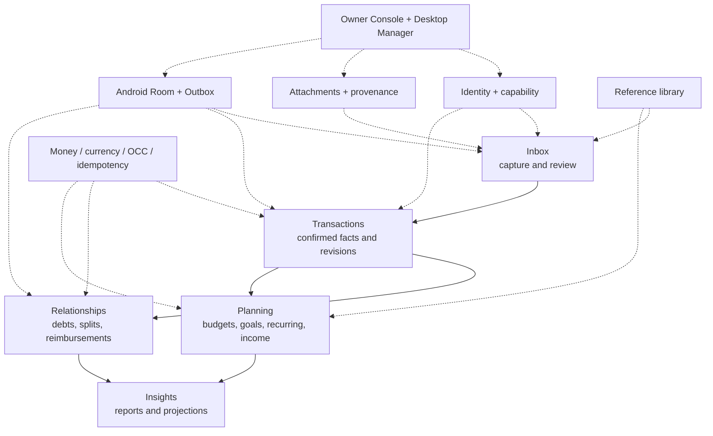
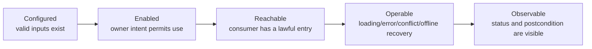
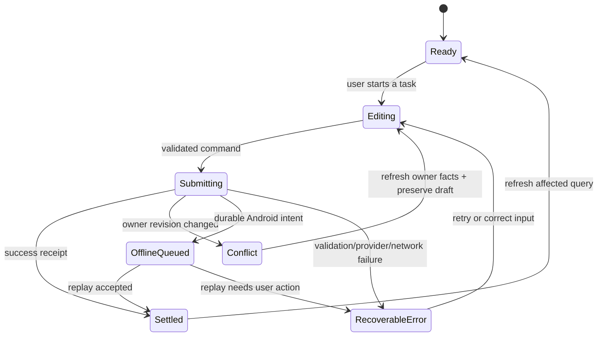
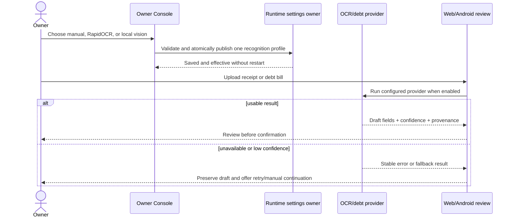
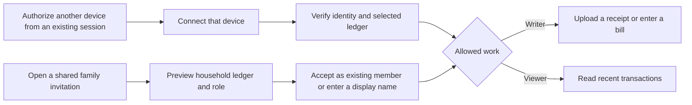

# Ticketbox current product atlas

> Derived implementation map, not a product authority. The authoritative subject is the Git commit that contains this file. Reverify after changes to registered routes, domain services, runtime settings, Room/Outbox, Desktop Manager, packaging, or consumer navigation.

This atlas derives a current construction map from the Goal, latest user rulings and three 2026-08-26 contracts. It records what exists, what is only partially usable, what is genuinely missing, and what must retire. `COMPLETE` is intentionally absent until exact Internal Beta RC qualification.

## 1. Product and container architecture



There is one backend runtime and one set of fact owners. Web, Android, Owner Console, Desktop Manager and Shortcut are consumers with different trust and interaction boundaries; none may become a second business owner.

### Runtime lanes and tool boundaries



The containers above are responsibilities, not a request to split the modular monolith into services. Adapters may change; commands, permissions, facts and user receipts remain owned by the application layer. A tool is not a product capability until a real consumer can configure or reach it, recover from failure, and observe the postcondition.

## 2. User work and backstage



The five domains are the product. Backstage exists to make them installable, configurable, observable and recoverable; it is not a second product navigation.

## 3. Capability control boundary

Every capability is evaluated through the same five links:



| Setting kind | Fact owner | Product surface | Rule |
|---|---|---|---|
| Ledger/business preference | Domain service | Web and Android | Available where the household performs the task |
| Safe live operator setting | Service-owned runtime projection | Owner Console | Atomic save, validated, immediately observable |
| Secret, database, service or install boundary | Windows lifecycle | Desktop Manager or read-only diagnostics | Never exposed as a casual web toggle |
| Internal maintenance policy | Owning service/scheduler | Health/status first | Add a manual control only for a real recovery task |

This replaces the old advice to edit the runtime projection or `backend/.env` from a web page. The projection is an implementation detail; lifecycle-owned settings stay lifecycle-owned.

## 4. Current capability classification

| Capability | State | Current owner and consumers | Required disposition |
|---|---|---|---|
| Upload links, Shortcut capture and pending review | `EXISTING` | Upload/expense services → Shortcut, Web, Android, Owner | Preserve and improve task feedback |
| Confirmed financial facts, revisions and offsets | `STRONG_SLICE` | Financial fact services → Web and Android | Keep exact OCC/revision semantics; RC qualification remains |
| Debts, splits and reimbursements | `STRONG_SLICE` | Relationship services → Web and Android | Preserve offline intent and lineage |
| Budgets, goals, recurring and income plans | `STRONG_SLICE` | Planning services → Web and Android | Continue consumer-level completion and visual migration |
| Reports, trends and projections | `STRONG_SLICE` | Insight read models → Web and Android | Continue information hierarchy and empty/error work |
| Receipt and debt-bill recognition | `STRONG_SLICE`, merged in #353 | OCR/debt parse services → upload/review/debt consumers | Preserve Owner selection, enablement and shared-pipeline status; full product RC qualification remains |
| Currency adoption when existing evidence requires it | `STRONG_SLICE`, merged in #354 at `684c0dd8` | Installation binding/adoption service → Desktop product bridge; Android compatibility guard | Candidate and exact merge-main cloud qualification passed; keep old maintenance API retired |
| Manual FX recovery for one pending foreign-currency expense | `STRONG_SLICE`, merged in #355 at `06edbbde` | Expense snapshot owner → shared pending edit command, Web edit and Android PatchExpense | Candidate and exact merge-main CI/CodeQL/Connected passed; merged branch retired. Preserve explicit canonical review and offline intent |
| First use, connection and household entry | `PARTIAL` / under current verification | Installation/account/ledger owners → Desktop, Web and Android | Simplify the role-specific first-use journey, explain data ownership, preserve entered setup and provide one actionable recovery step |
| Manual expense entry on Web | `STRONG_SLICE`, native command in #359 and browser draft continuation in #368 | `create_manual_expense` → native Web form, API and Android manual-entry sheet/Outbox | Exact candidate and merge-main `f1b4ff4a` are cloud-qualified. The amount-first form retains browser-local drafts and immutable unknown-response retries, with canonical acknowledgement retirement. Re-enrolled Device drafts remain readable for reconciliation, never rebound. No full offline-browser startup or transparent new-Device replay claim |
| External-debt context: remember why this obligation exists | `STRONG_SLICE`, merged in #361; current main qualified | Debt create/query owners → Web and Android entry/detail | Optional context persists through the shared create fingerprint and canonical responses, appears in both clients, and survives ordinary rejected submissions. The discarded Web field is retired. #363 resolved cloud shard capacity and current main passed its own complete cloud gates; the historical timed-out merge remains unqualified. Durable Android create recovery remains the separate gap below |
| Android external-debt create recovery | `PARTIAL`, #369 candidate implemented; final qualification open | `DebtCreationRepository` → bound Room Outbox → `CreateDebtDispatcher` → unchanged backend Debt owner | Original submitted payload/key/owner persist before network; local acceptance is not a Debt. Real Room close/reopen, original-key retry and shared pending/list-to-sheet consumers passed cloud Connected at `92452670` (107 tests). The sole ordering regression has observed RED and its coordinated collector fix awaits exact-head GREEN. Keyboard-visible interaction, physical process restart and unsubmitted editing-text restoration are not claimed |
| Recycle bin | `DUPLICATE` | Web recycle owner plus narrower Owner Console implementation | Promote the complete Web journey; retire the duplicate Owner writer/surface |
| Public admin API exposure | `DORMANT` / `RETIRE` | Backend route group, no product consumer | Keep local maintenance boundary or remove exposure toggle; do not invent a UI consumer |
| AI advisor | `PARTIAL` | Advisor service + consent UI → Web/Owner | Provider secrets remain lifecycle-owned; surface readiness and missing setup honestly |
| FX sync and maintenance schedulers | `PARTIAL` backstage | Scheduler/service → status and selected manual actions | Add control only where an operator must make a product decision; otherwise expose health |
| Runtime diagnostics | `EXISTING` but developer-heavy | Backend/Owner/Desktop | Replace raw paths/route inventory with task-oriented health, then retire developer surfaces |
| Consumer visual art and brand completion | `PARTIAL` / visual acceptance outstanding | Shared tokens/assets and real Web/Android surfaces | A distinct delivery wave: art direction, brand/icon/illustration assets, background/texture, typography, motion and cross-screen finish; existing Paper/Midnight implementation is not design authority |
| Android offline mutation publication | `STRONG_SLICE`; shared recovery usability remains partial | Room Outbox → registered dispatchers → backend owners | Preserve full mutation-type/label/dispatcher coverage. A following shared-recovery task must distinguish multiple same-type failures with safe human-readable intent context: current SyncStatus cards expose the operation label and error but not the specific counterparty/amount, so choosing a particular record to discard is unclear. Never solve this by exposing raw keys or silently dropping intents |
| Windows Fresh G2 | `CLOSED` | Windows lifecycle | Do not reopen without an executable product counterexample |
| Restore, upgrade/downgrade and complete lifecycle operations | `HOLD` | Windows lifecycle | Remain outside current product construction |

### Horizontal foundation coverage

| Foundation | Current reality | Strengthening rule |
|---|---|---|
| Identity and household authority | Account, ledger membership, devices, invitations and session lineage exist | Every new journey reuses permission and ledger scope; no page-local authorization |
| Money meaning | Minor units, original/home currency, binding and revision facts exist | Block ambiguous writes, but always provide a reachable recovery journey |
| Concurrency and replay | Row OCC and idempotent commands exist on fact-changing paths | Preserve drafts on conflict; refresh owner facts before retry; do not bind command eligibility to a failed list query |
| Offline delivery | Android Room/Outbox dispatch coverage exists | Every new Android mutation needs enqueue, dispatcher, label, settlement and recovery together |
| Attachments and provenance | Protected originals, thumbnails and OCR facts exist | Suggestions stay drafts; confirmation owns the financial fact |
| Background work | Task catalog, leases and schedulers exist | Surface queued/running/failed/succeeded truth where the user waits; no spinner without settlement |
| Runtime capability control | Public URL and recognition groups are service-owned | Safe live settings use one atomic grouped command; secrets and install boundaries remain lifecycle-owned |
| Diagnostics and recovery | Owner/Desktop diagnostics and maintenance actions exist | Prefer task health and one recovery action over raw paths, route dumps and implementation jargon |
| Presentation system | Shared Web/Android semantic tokens and responsive shells exist | Migrate real journeys without capability loss; remove old component/CSS owners as consumers move |

### Common user-operation state model



Screens may express these states differently, but they may not collapse them into one generic failure. A successful command remains successful even when the following query refresh fails; the UI shows the receipt and offers a separate refresh retry.

## 5. Corrected operation journeys

### Recognition and assisted entry



### Currency adoption

```mermaid
sequenceDiagram
    actor O as Installation Owner
    participant D as Desktop product bridge
    participant C as Currency adoption service
    participant B as Installation binding + audit
    participant A as Android Outbox worker
    O->>D: Open any money page
    D->>C: Read adoption preview as paired Desktop owner
    C-->>D: Evidence conclusion + binding revision
    D-->>O: Explain one-time choice and consequences
    O->>D: Confirm original home currency
    D->>C: Form command + evidence token + OCC + idempotency
    C->>B: Lock, revalidate owner/evidence, activate once
    B-->>C: Durable receipt + audit actor
    C-->>D: Active binding
    D-->>O: Money features restored
    A->>C: Read runtime compatibility before drain
    alt compatible
        C-->>A: compatible + API version + currency binding
        A->>C: Replay existing durable intents with negotiated headers
    else adoption still required or read unavailable
        C-->>A: owner action required / unavailable
        A-->>A: Preserve rows; show Owner action when required; retry later
    end
```

The installation claim account is the authority; the browser form is only its Desktop consumer. A naked browser, a different account and the retired maintenance API cannot adopt. Evidence conflicts keep every amount unchanged and route the Owner to the existing Desktop diagnostics shortcut. Android reads the shared compatibility conclusion before draining and shows the installation Owner's next step in Sync Status. Immediate and queued writes negotiate the current API version and currency binding. A failed negotiation read or a binding activation race remains retryable, preserving the queued intent.

### Missing FX rate recovery

1. Pending review identifies the original currency/date and says why confirmation is blocked.
2. The original Web and Android editors accept `1 original currency = N home currency`, explicitly for this bill only. A member can correct an entered rate before confirming.
3. The existing pending edit command applies the rate and any edited amount/date in one Expense OCC/idempotency transaction. The backend records the manual source and effective transaction date, computes the home amount, and returns a still-pending bill. It never writes the shared daily ExchangeRate table for this task.
4. The editor stays open to show the canonical conversion before the user confirms. Browser and Android do not create a competing FX calculator or treat an unreviewed local estimate as ready.
5. Android queues the rate with the existing PatchExpense intent when offline. It explains that conversion awaits synchronization; ordinary already-ready offline confirmation remains available.
6. Validation failure, conflict and response loss preserve the complete draft and stable retry identity. Web and API share the edit transaction owner; the old Web direct-commit bypass retires as its consumers move.

The previous map confused an existing ledger-wide manual daily-rate endpoint with an existing single-bill recovery command. Current code established that distinction; the product task determines the new scope. Shared-rate administration and provider ingestion are not silently coupled to editing one bill.

Current-slice evidence (revisit on the listed paths or a direct failing journey; retain only the load-bearing regression after this slice):

| Claim and falsifier | Owner / consumers and trigger paths | Evidence and cost |
|---|---|---|
| Rate recovery remains pending, affects only one bill, and cannot overwrite stale facts; falsified by shared-rate mutation, early confirmation or stale overwrite | Expense snapshot + pending PATCH; schemas, currency/update services | Focused real PostgreSQL command journey; seconds locally, full PG on exact cloud candidate |
| A user reviews the conversion without leaving the task; response loss cannot duplicate or lose the save | Shared edit command + Web full/drawer forms; edit routes/templates | Real authenticated form submission, idempotent replay and draft/error responses; focused local PG |
| Offline save retains the rate intent without invented ready money | Android DTO/draft, PatchExpense and edit ViewModel/screen | Focused JVM payload, queue and settlement tests; connected execution on exact cloud candidate |
| The public wire contract matches every changed consumer | API schema / Android DTOs | Generated OpenAPI check plus exact-head Backend/Android/Connected qualification; no new permanent audit registry |

### Manual expense entry — native command consumer qualified

Web has a native `/web/expenses/new` entry from the product shell, overview and transactions, plus the `N` shortcut outside active editing. It uses the existing `create_manual_expense` command, not a second writer. The command records the real Account/Device actor, uses device-scoped `client_ref` replay and retains the existing distinction between confirmed creation and a missing-FX pending bill. The latter continues into the existing single-bill exchange-rate recovery editor.

The original form carries its ledger, browser Device public identity and create identity. Validation or command refusal preserves the entered fields and the same binding. A changed ledger refuses instead of rewriting the destination; a re-enrolled browser cannot turn the old device-scoped retry into a new create. The shared command revalidates credential, membership and role under the existing identity-lifecycle transaction lock. Multi-currency amount input is parsed by the shared currency owner, without applying the home currency's browser step constraint to foreign money.

Exact cloud candidate `6b746f7e96a8c163baf9ce171a0e944067a93a8d` exposed two real PostgreSQL failures: stale-ledger and revoked-role forms incorrectly returned success. Candidate `d4db13a810c5652dc2d02283f1f1132aaf61d225` additionally exposed the re-enrolled-browser form returning 303 instead of 409. Final candidate `efaae954e3d6a58d80f3eed50eff129c3682afb8` retains the original Device binding and passed exact cloud qualification; merge `6829b61317ff856b5ca80194ab078d3e4a38ffc7` independently passed CI, CodeQL and Connected workflows. Scope-skipped executions are not execution evidence. Refresh/session-expiry draft continuity remains a required completion task. No browser offline queue or whole-product visual completion is claimed.

Draft-continuation closure (#368): exact candidate `43d77dd01411f3e3aa6dc0e5955352fe4ecc5ae9` passed CI `33986217561`, CodeQL `33986217517` and Connected scope gate `33986217581` (actual Connected scope-skipped). Normal merge-main `f1b4ff4a3eda6a6a76eb938543c8d7fb411e7d01` independently passed CI `33986845297`, CodeQL `33986845319` and actual Connected `33986845322`. The browser stores only the six editable field strings, original create key/phase and Dataset/generation/Account/ledger/Device scope, never credentials. A Web Lock keeps another tab from overwriting the same draft. Unknown-response retry preserves the exact snapshot and key; only an actual saved manual Expense under the current authenticated Device acknowledges retirement. Validation rejection permits correction, while a changed binding cannot silently retarget the intent. Old-Device drafts stay readable for manual reconciliation. Native/no-JS command ownership remains unchanged. This supersedes the pending draft-continuity statement above, within these boundaries.

Real cloud Edge covers localStorage, Web Locks, reload/navigation, native POST, unknown-response same-payload retry and acknowledgement consumption. Real PostgreSQL separately proves the canonical producer and financial owner. Physical BFCache admission and full browser-process restart were not independently exercised; the actual persisted-page event consumer has an observed pure-Node RED/GREEN. At 360 × 800, the empty form's Save ends at 485 px rather than 940 px, with no horizontal overflow. Whole-product visual acceptance and final RC remain open.

### External-debt context — implemented and current main qualified

The user must be able to remember why a manually recorded external obligation exists, including when several obligations involve the same person. An optional plain-text note (maximum 500 characters) belongs to that Debt, is shared with the same authorized viewers as the Debt, and never changes principal, repayment, settlement or member-consent meaning. Web and Android creation carry it through the existing command; canonical detail responses and each client's detail surface display it safely. Blank input becomes no note; existing rows remain unannotated rather than receiving invented context. The original Web field silently discarded input and must no longer remain surface-only.

This is create-time context, not a new editable financial fact, chat system or attachment store. A later context-edit task needs its own intent/OCC decision. At this context slice's base Android created Debt online only; its note-on-rejection proof does not claim durable offline publication. The separately tracked #369 successor implements submitted-intent continuity and must qualify independently. Backend PostgreSQL, Android transport/state tests and connected execution qualify the exact candidate in cloud; no local heavy test lanes.

Test-first subject `6f1b4fe2a12de103c75e665983f2727f6cf8f308`, CI `33962984089`, reproduced missing context in the real native successful-create detail (ordinary 1/2) and validation-failure form (ordinary 2/2). The pure request boundary also rejected `note` as an extra field before implementation. Production changes cover the nullable migration, existing command/query, both clients and failure retention. Final candidate `5667a49de26498b2c9a9b617cbd65e7b2ce38674` passed CI `33966892365`, CodeQL `33966892372` and actual Connected execution `33966892400`, with no open bounded-review finding. Merge `1b0a7631e089264b38daeaa75ee75d999b4e4f07` independently passed CodeQL and Connected; CI `33967598659` real-db 2/2 was canceled at its 12-minute job cap in both attempts, first after 100% progress and then after 94%. No test failure was reported, but that historical merge remains unqualified. The bounded capacity repair #363 is merged at `690b28b4`: existing complete real-db selection now uses three isolated cloud clusters, still one serial worker each. Its candidate `4e565f26` passed all three workflows and 285 real-db tests (89/98/98); the slowest whole job was 8:06, with no timeout/assertion/database change. New exact merged-main qualification is independent and still required; candidate green cannot replace it. Full-product and held Windows lifecycle qualification are not implied.

Current main `90a9bb19ae9b7edd024aa016b6991f44c4bcdc9e` independently passed CI `33974633849`, CodeQL `33974633790` and Connected `33974633805`, including actual Connected execution. This closes the current baseline's cloud qualification; it does not relabel the failed historical heads or qualify the full Internal Beta RC and held Windows lifecycle.

Successor main `872c759a9b326746a38f9d87b14dc7a24080b255` (#365, test-only asynchronous completion) independently passed CI `33975834073`, CodeQL `33975833963` and Connected `33975833975`. Both the qualified budget behavior and external-debt context remain integrated. These are current-source cloud results, not RC dress-rehearsal evidence.

### Budget first step — consumer convenience, qualified

A first-time Web budget writer starts with one total and one native Save action in a single compact task region. Existing rollover, reserves, exclusions and category-budget capabilities remain in the same form under optional settings; configured budgets and rejected drafts expose those settings immediately. The existing Budget command, current month/ledger binding, authorization and fresh execution-versus-draft distinction are unchanged. No wizard, new financial default or second draft owner is introduced.

Progressive enhancement closes only first-use options after installing the native validation-reveal handler. A browser-rejected input inside closed options reopens that section and receives native focus; without scripts all original inputs remain visible. Read-only production-template previews at 360/768/1440 demonstrate the first-screen action and keyboard/error visibility in both appearances. Final candidate `51ec47fc20079d61bfc44c4ee6e25f63080341fd` passed CI `33974019522`, CodeQL `33974019460` and Connected scope qualification `33974019529`; real PostgreSQL covers native save, rejection retention and permissions. Its #364 merge is the independently qualified main above. No local heavy lane was run. Durable refresh/session draft recovery and whole-product consumer visual completion remain separate required work.

### Recycle recovery

The complete Web recycle journey becomes the only product owner for list/restore. Owner Console links to that journey for operator convenience; its narrower duplicate query/restore implementation is physically retired.

### First use and binding — invitation handoff closed, local Web identity active

The exact `8aca512a6fe6ac64e1fe7d76bece66fccc4be214` starting main baseline has working Account/Device/Member/Invitation/Session owners, Android durable enrollment, Desktop credential storage and a native Web invitation consumer. At that baseline, local Web still treated loopback location as an anonymous Owner projection. This slice closes that break by establishing a real browser Account/Device/Session before product work.



The family invitation handoff now uses existing enrollment/session owners on Web and Android. The entry itself carries intent; users do not choose a technical pairing/invitation category. A new person supplies only a display name, the device identity is product-owned, destination/role is shown before acceptance and failure recovery remains in the same task.

The shared create-invitation result supplies an optional `https://configured-origin/web/auth/join#invite=...` URL. Its origin comes from the configured public endpoint, never the request Host. Without that configuration, the existing one-time token remains available for explicit paste. This is configured access, not proof of network reachability. No new token store is introduced.

Web removes the fragment before submitting a native preview form; each acceptance form retains its own target, not a shared target cookie. Existing Web identity is checked independently of the old selected ledger, without dropping Web platform/expiry requirements. A new browser uses the existing recoverable enrollment proof and the same eight-hour policy as browser pairing. Android accepts the link through paste or explicit text sharing, previews anonymously, and compares server identity and data generation. For the same server it accepts only through its current authenticated binding. A different server opens the browser continuation and cannot replace the app's identity or Outbox. Arbitrary-domain verified Android App Links are not claimed.

Follow-up identity binding: a native Web confirmation also retains the Account public identity shown in its preview. A different login in another tab refuses before invitation consumption and presents the new identity for explicit confirmation. An anonymous preview is explicitly unbound; existing enrollment/replay and two open anonymous invitations may establish and reuse one browser identity. The public form marker is only a stale-intent comparison, never authentication or membership authority. Exact test-only candidate `849ce9f7f0afe32ea4288203d76ac84a4d1cd53c` reproduced the wrong-account success in cloud PostgreSQL CI `33960293958`. Final candidate `31024edaff75aadb48adbe20d32cc47c9195c096` and merge `b3408fff332efb5dcbcaf0e80dc81d4edea0a430` independently passed their applicable cloud CI, CodeQL and Connected workflows; scope skips do not count as executed Android tests.

These invitation consumers were merged and qualified on the exact main SHA above. The small gate map below remains only as semantic regression ownership; revisit it when the listed owners/consumers change or a direct user counterexample appears.

| Claim and falsifier | Owner / real consumers and changed paths | Matching proof / cost |
|---|---|---|
| One invitation creates or joins the intended identity once; old membership availability cannot veto a valid identity join | Invitation/enrollment/session services; API and native Web join routes | Real public-session PostgreSQL forms: preview, new/existing identity, response loss and two-tab targets; seconds locally |
| Shared links identify the configured destination without publishing bearer data in HTTP URLs/history | Shared invitation create result; Web family/share/fragment intake and Android share/paste | Configured-origin response tests plus actual Edge fragment/native/no-JS interaction; bounded browser run |
| Same-server acceptance preserves the binding and pending intent; foreign server never receives the stored credential or replaces local identity | Android join repository, session coordinator, navigation and screens | Focused JVM transport/session/Outbox assertions; exact cloud Connected for real integration |
| Public schemas match changed consumers and current candidate qualifies | Invitation DTO/OpenAPI; Web/Android/backend lanes | Generated schema and exact SHA cloud results; no new audit registry or fixed test-count claim |

#### Local Web identity

The loopback browser is a product client, not proof of identity. On an installed dataset it must consume the single `InstallationOwnerClaim.account_id`, show the real Account plus live ledger/role choices, and establish one recoverable eight-hour Web Device/session after one explicit confirmation. The claim's Windows source Device must still belong to that Account and remain live before it can authorize a new browser Device. It must not ask for a technical connection code or device name, require the Desktop Manager to be opened first, infer the first Account, or grant Owner because the request came from loopback. Development datasets without an installation claim retain their explicit development-only compatibility path; an installed dataset with a missing or ambiguous claim enters recovery instead of choosing an identity.

The session principal is independent of its compatibility-default ledger. A live Account/Device credential may switch among that Account's active memberships without changing identity. Every read and write reuses the current membership role; a removed membership or archived ledger cannot be resurrected by the cookie. Invalid, revoked or expired cookies are cleared and sent back to the identity task, never to the anonymous Owner projection. Recovery drops a stale `ledger_id`; an expired unsafe form submission returns through its same-origin Web GET page, or `/web` when no safe referrer exists, rather than treating the mutation URL as a GET. An otherwise valid Web cookie for another Account is also cleared on installed loopback and cannot replace the installation claim. Local logout revokes the browser token and returns to the local confirmation task; public logout keeps the pairing entry. The first confirmation and a proven response-loss retry share the existing enrollment proof, Device and token; reusing the proof for another Account or ledger is refused and clears the spent proof so a fresh confirmation can recover.

| Claim and falsifier | Owner / real consumers and changed paths | Matching proof / cost |
|---|---|---|
| The installation Account is the browser actor even when it is only a member of another Account's ledger; falsified by an expense/audit row attributed to the ledger owner | Installation claim + identity enrollment; loopback auth entry, middleware and one real Web mutation | Real PostgreSQL browser form and canonical stored actor/device assertion; focused local lane |
| Viewer can connect and read but cannot write; role removal or ledger archive takes effect before the next action | Live LedgerMember/Ledger state; session projection and write gate | Real browser GET plus native POST denial after live state mutation; focused local lane |
| A bad cookie never falls through to local Owner, while a live identity can choose another active membership after its old default dies | Web credential owner + ledger switch service; middleware and ledger selector | Invalid/revoked/expired cookie redirects and clears; identity-level picker switches with the same Account/Device/token |
| Response loss returns the same Device/token and the same proof cannot target a different Account or ledger | DeviceEnrollmentAttempt + internal installation pairing source | Two submissions with the same proof plus changed-target refusal; row-count and credential-hash assertions |
| Public Owner pairing and Desktop bridge behavior do not change | Existing public `/web/auth/login`, pairing service and Desktop bridge middleware | Existing focused auth/public/desktop regressions; no Windows lifecycle or installer qualification claim |

Owner device inventory derives browser availability from live Web credentials, including expiry and revocation. Ended browser sessions stay in a collapsed history section and do not count as connected devices. Reconnection creates a separately accountable browser Device; listing and counting never delete or revoke historical Device records or another browser's session. The public Device API retains its existing device-revocation semantics.

Desktop first-use explanation and expired-code recovery links remain companion gaps after this identity slice. Web manual entry and bounded browser-local draft continuation are qualified as described above; re-enrollment does not transfer old Device intents. Installation currency adoption remains a Desktop-only ceremony. These facts do not authorize reopening installer, account recovery, upgrades or other Windows HOLD work.

Review carry-forward — `HOLD`: local Web identity confirmation does not bind the GET preview to its Account/dataset generation before the first POST. If a held restore replaces the installation identity between those requests and retains the chosen ledger ID, submission can issue a session for the replacement identity. Revisit with restore qualification: bind the expected identity to the confirmation proof and compare it under the issuance lock. No restore or repair action is opened by this finding. Evidence: `web_auth.local_web_identity_form`, `local_web_identity_submit` and `identity_service._local_web.connect_installation_web_identity` on `b47238db`.

Review carry-forward — `HOLD`: an unbound Android invitation can be previewed before an in-place dataset restore and accepted after the restore has changed `client_generation`, if the restored backup contains the same unused invitation. Existing enrollment persists URL/token/name/device and validates the returned attempt, but does not persist the preview's dataset/generation. Closing this requires an expected-identity field in the durable enrollment intent/secure codec and validation before credential publication, including process-death recovery; a ViewModel-only check would be incomplete. The counterexample depends on the held restore lifecycle and is not a current invitation-consumer blocker. Revisit with the restore qualification or an independently scoped enrollment-identity change; do not silently drop it or reopen Windows lifecycle in this slice. Evidence: `dataset_restore_service.resolve_restored_dataset_plan`, Android `DeviceEnrollmentIntent.Invitation`, `SecureDeviceEnrollmentCodec` and `DeviceEnrollmentCoordinator.accept` on review subject `2a5425db`.

## 6. Visual art and convenience — explicit delivery wave

Visual art is a first-class product outcome, not an implied subtask of functionality or an RC-day polish pass. Each active slice preserves usable visual and interaction states. Once the current Web/Android consumer migration is closed, complete a dedicated whole-product art, visual and convenience wave before continuing the remaining product expansion.

The Owner's September 5 photo is a reference, not a selected design or a requirement to preserve its palette or paper treatment. The main agent owns the final design direction: modern consumer software, not a dated desktop-management or government-service aesthetic. Existing themes, panels and assets have no visual authority; typography, spacing, hierarchy, controls and feedback must work together across real daily tasks.

- Establish coherent art direction and brand assets: icons, illustrations, empty states, backgrounds and textures. The rejected mascot has no preservation requirement; the explicitly rejected green-hat direction must not return.
- Complete the production visual system across typography, color, spacing, information hierarchy, semantic components, focus/motion and light/dark appearances. Global custom background preferences must work coherently across applicable surfaces, not just decorate one page.
- Make frequent tasks easier through appropriate defaults, keyboard/touch actions, shortcuts, batch handling, fewer repeated inputs and recoverable drafts. Web and Android share product meaning, not forced identical layouts.
- Migrate the existing valuable behavior into the chosen production system and physically remove replaced CSS, components, assets and duplicate entrances. No second runtime, detached demo or permanent old/new surface pair.

Exit evidence is actual Web pages at 360/768/1440 and real Android journeys, including appearance preferences, forms and loading/empty/error/conflict states. Inspect their visual quality and perform the actions. A build, token inventory, screenshot count or successful API test does not establish consumer-grade visual completion. The wave is still pending; the current manual-FX browser probe qualifies only that editor's layout, not this whole-product claim.

The wave is in construction through #362. Its first task aligns Web and Android genuine empty receipt states with quiet static receipt/coral-side-clip art, neutral state copy and useful native actions. Web removes zero-total filters and row/bulk controls with no rows; filtered-empty results retain the real return path. Android Inbox/Ledger consumers move off the old empty mascot wrapper, without altering loading, role, sync or publication owners. Ledger's empty action uses the same existing primary component as Inbox, with an actual manual-sheet entry assertion. Web 360/768/1440 previews, viewer/filtered states, keyboard focus and custom-background Paper/Midnight readability were inspected; the semantic solid surface has an observed browser RED/GREEN. Exact candidate `49cb0bed` passed CI `33975562003`, CodeQL `33975562007` and actual Connected `33975562011`; all three fresh Compose captures were retrieved and inspected, including the corrected Ledger button. Strict branch protection requires current main `872c759a`, so the candidate is updated normally despite the content-identical merge. The new head and its eventual merge require their own qualification. Evidence and historical failure dispositions remain in `docs/superpowers/plans/2026-09-05-consumer-art-convenience.md`. These are synthetic-state consumer frames, not complete application journeys. This task is not the whole five-domain visual system or durable-draft completion.

The first art task (#362) is now closed: exact candidate `ada29913` and merge-main `fba121c9552d9dca4a03fe319da587d31f2bf2a9` independently passed CI, CodeQL and actual Connected workflows. Main's runs are `33977721474`, `33977721459` and `33977721470`; final candidate PNGs match the already inspected consumer frames. This supersedes the pending-integration status above, without relabeling historical failed candidates.

The consumer workspace frame (#366) adds clean-default Web surfaces with preserved explicit preferences, synchronized light/dark neutral tokens, one icon-and-label primary navigation for desktop/mobile, fewer repeated headings and a single Android default-background palette. Actual 360 px populated-page inspection admitted and fixed Ledger batch-form overflow; actual theme switching admitted stale canvas colors in both existing chart consumers, covered by an observed pure-Node RED/GREEN. Exact candidate `78febc17` passed CI `33980002606`, CodeQL `33980002598` and actual Connected `33980002594`; its three fresh PNGs match inspected frames. Normal merge-main `d74ef57ea9794919783efe19ea2c052dba3d6e20` shares the candidate tree. Its CodeQL `33980781789` and Connected `33980781853` passed, but CI `33980781739` failed in the Desktop theme probe. The separate test-only readiness/exception-reporting correction (#367) is now closed: candidate `3b24f8a3` passed its scoped gates and review, and normal merge-main `9cf0754c6c95982fe5e8184aed70d1073d491677` independently passed CI `33982506046`, CodeQL `33982506028` and actual Connected `33982506039`. This does not relabel the historical d74 failure. Complete art, real Android journeys, form/draft convenience and the remaining product tasks stay open in the same wave. The manual-draft task (#368) is now independently qualified on candidate and merge-main as recorded above; the full wave remains open. Details are in the existing consumer-art plan.

## 7. Construction order

1. **Recognition control:** close configured → enabled → observable for receipt and debt-bill recognition in the existing runtime-settings owner.
2. **Currency adoption ceremony:** unblock an installation that otherwise cannot perform any money write.
3. **Pending FX recovery:** complete a single-bill edit/preview/confirm journey across Web and Android.
4. **First use and binding:** verify and simplify the role-specific connection, identity, ledger and first-entry journey, without reopening Windows lifecycle.
5. **Consumer migration closure, then visual-art and convenience wave:** verify that already-productized Web/Android capabilities survived the migration, complete the explicit wave above, and retire replaced production visual structures.
6. **Backstage consolidation:** retire duplicate recycle/admin/developer surfaces and replace raw implementation detail with task health.
7. Return to the five domains, select the highest user-value `PARTIAL` or `MISSING` chain, and repeat until exact RC.

Each slice stops after its frozen user postcondition is true, targeted regression passes, and exact-head cloud evidence has a disposition. Neighboring gaps remain in this goal map, with the owning journey and a reactivation step, rather than disappearing through repeated HOLD decisions. Fewer repeated inputs, fewer unnecessary page transitions, clear keyboard/touch actions and recoverable drafts are product outcomes, not optional finishing polish.
