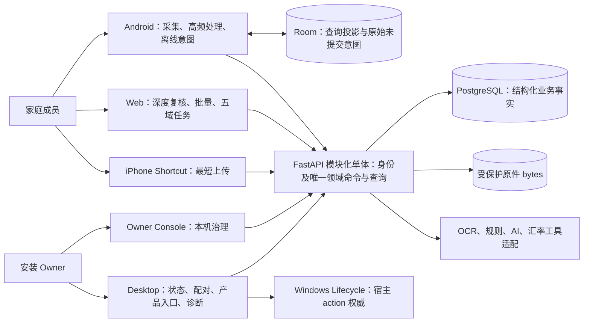

# Ticketbox 当前产品地图与修订规划

完整摸排日期：2026-09-19，施工状态更新于 2026-09-20。主线、未合并候选与日常安装分开核实；具体版本、来源和证据边界见[事实记录](../qualification/2026-09-19-product-assessment.md)，后续片的实现与资格证据见各当前合同及对应 PR。本图保留能力、状态、剩余用户结果和施工关系，不重复承载工程运行记录。

**产品已经远超截图记账：五域都有真实业务实现，跨域关联、外币、纠错、离线提交和恢复已有大量可保留成果；完整产品与 exact Internal Beta RC 尚未完成。** 主要欠账是财务解释的一致性、完整历史与业务续办、数据可携带性、持续使用的跨端连续性，以及最终真实场景资格化。不能把这些缩成几个页面或最近几个 PR。

本图负责现状、差距、保留条件和施工顺序；[用户旅程](TICKETBOX_USER_JOURNEYS_CONTRACT.md)及已有纵向合同负责详细语义。历史资格记录继续保留，失效的“当前下一步”由本图替换。本图是从有效目标推导的施工地图，不是第四份架构，也不增加运行时或证明体系。

## 1. 目标、版本与阶段

| 依据 | 本次确认的身份与适用范围 |
|---|---|
| 当前 Goal 全文、后续用户裁决 | 方向、边界和授权的上位依据。Codex 主导架构、产品、实现、美术、交互、验证和集成，自行安排施工，不逐片等待确认。2026-09-19 再明确：按原完整目标摸排，能力只能加强。 |
| 2026-08-26《产品与全系统架构合同（当前版）》Rev 2.0 | 两份顶层架构之一，正式继承 8.17 完整产品并补齐容器、领域、权威和数据流。五域、共享承重、S/D/F/C/Q、Promote/Consolidate/Extend 保留。 |
| 2026-08-26《Windows 与数据生命周期架构合同（当前版）》Rev 2.0 | 第二份顶层架构；8.24 Fresh-G2 是纳入其中的 action profile，不取代产品目标，不自动授予其他生命周期资格。 |
| 2026-08-26《G2 后产品完整化与 Internal Beta 施工合同》 | 当前阶段执行合同。Fresh-G2 关闭后完成产品 P1/P2，再冻结并演练 exact RC 的 P3，随后进入观察。不是第三份架构。 |
| 2026-09-01 公网连接任务裁决 | Stage 1 只读观察及产品投影；Stage 2 宿主 mutation 仍受明确条件约束。配置 URL、Tunnel 正常不能代替产品可用。 |

本次读取 Gmail 最终邮件并核对附件包及三份文件哈希；所检索后续邮件未发现替代这两份架构的新版本。旧 ADR、路线图、助手归纳、测试名和 PR 都是线索或实现证据。

2026-09-20 更新的 Goal 已移除旧安装版本、未闭合 #404 和旧交接顺序；完整目标与持续授权保持有效。当前无须改变既定目标或边界即可推进本规划。

**保留与加强是交付条件：**每片明确原来能完成的任务、权限、币种、历史、离线、冲突和恢复路径；替代路径承接全部有效能力，再以更少重复输入、更清楚结果或更强恢复证明增强。旧实现在真实消费者迁移后物理退役。不得以删入口、缩支持范围、丢历史、改成只读或仅增加拒绝交差。

**长期同级标准：**系统可以复杂，因为真实业务本来就复杂；实现不能跟着复杂，复杂性要被压缩、收口、封装。允许问题域复杂，不允许复杂性在代码库里到处扩散。ACK 丢失、OCC、绑定切换、离线恢复、跨端一致性的必要复杂性由清楚的领域 Owner 和责任边界承担；入口、消费者与恢复路径复用同一规则，避免重复状态、平行 writer、桥接层和多处维护。不能为表面简单删能力，也不无条件禁止合同内必要的模型调整或把责任堆成另一个巨石。文档同样分责：本图保存全局原则，直接合同记录本片如何落实。

## 2. 真实产品与数据关系

五域回答用户问题：收件“有什么待处理”，流水“实际发生什么”，往来“和谁未了结”，计划“怎么花、存、还”，洞察“发生什么变化”。它们不冻结 tab 数量，也不是五个微服务；Owner 与 Desktop 属于 Backstage。

| 真实业务链 | 已有事实、意图及关联 | 必须保留的意义 |
|---|---|---|
| 证据成为流水 | 上传请求/CSV 行 → 原件及来源 → OCR/规则建议 → Pending Expense → 人工确认；ExpenseRevision 记更正，ExpenseOffsetFact 表达退款/冲正 | 建议、工作流和事实分开。保留商品项、分摊、分类、商家、标签及来源；人工确认仍是事实入口。 |
| 消费产生往来 | Expense/Split → BillSplitInvitation → 接受后的关联流水及成员 Debt；外部欠款/应收由 Debt 命令创建 | 保留对方接受、经济事件身份、可见范围和防双计数；跨账本关联不是两笔独立消费。 |
| 往来被了结或纠正 | Debt + Repayment/RepaymentVoid + Adjustment/Forgiveness/Void → fold → 余额、状态、还债目标进度；新候选以双方提议/接受事实关联原债与最多一笔返还债 | 余额由事实推导。还款、退款、免除和作废分工；重议保留原份额与已发生资金，双方明确接受后追加事实，不直接改余额掩盖未闭合业务。 |
| 计划读取与关联实际发生 | confirmed stream → Budget/开销 Goal 的执行进度；Debt fold + DebtGoalLink → 还债目标；IncomePlanRevision → 收入预测 → Budget/Advisor；Recurring Series → Occurrence ↔ 已确认 Expense 的显式关联 | 各计划不共用一种付款关联。固定支出义务月份与付款月份独立，显式关联后解除预留。收入计划和储蓄试算不代表到账或余额。 |
| 回看并继续处理 | 事实流 → 总览/月报/趋势/目标/预算/数据健康/CSV → 原流水、原往来、原任务 | 查询可重建，不成为第二 writer；金额、币种、期间及关联一致。 |
| 家庭和设备协作 | Account/Ledger/Member/Device/Session + Pairing/UploadLink/Invitation；Outbox 绑定主体、账本、版本和 key | 后端决定权限；receipt 不是新财务事实。撤销、换账本、换 token 不重新归属旧意图。 |
| 数据离开安装 | 分析 CSV、原件、历史和关联；已有完整备份 owner、manifest、原件校验、restore lineage 零件 | CSV、数据库归档、可携带产品数据、可恢复整套安装分别核实；现成零件继续复用，不互相顶替完成声明。 |

## 3. 能力现状与保留条件

“已成链”表示所列任务已有集成实现和相应证据，受其覆盖边界约束；“局部”表示有可用能力但整项不完整；“未验”是证据不足，不直接认定功能缺失。按适用的 Surface/Domain/Foundation/Continuity/Qualification 判断短板，不伪造产品总完成率。

能力核准统一按适用的 **configured → enabled → reachable → operable → observable** 检查真实任务：用户能找到入口，完成有效配置与启用，实际执行，理解结果并从失败中继续。这是通用核准标准，不要求新增五种状态对象或健康引擎。

| 用户能力 / 主要端与 owner | 已成立且必须保留 | 仍需加强或核实 |
|---|---|---|
| 上传、分享、待处理；Android/Shortcut/Web，Capture/Expense/Assets | 服务端原始上传身份/回执及原单识别任务，Android 文件暂存/UploadIntent 续办，识别草稿、人工复核、批量确认/拒绝、权限和重复提示已有实现；日常 Web 实际可上传/导入。 | Web 图片表单未传原提交键，未具备持久文件和 ACK 丢失续办；须沿现有提交/草稿 owner 补齐。不能把文字草稿或 Android 的恢复能力泛称为所有端已完成。最终 RC 仍补实体 Android/iPhone 的断网、原图及 Shortcut 错误分支，保留最短入口。 |
| 通知采集与提醒；Android notification / draft owners | 可选通知消费/还款草稿、包名白名单、投递去重及原账本绑定；消费与还款分流，仍待人工复核；已有预算/备份等提醒保留。 | 核实系统授权、原任务深链与续办；还款草稿当前不发“去核对”通知，不能误导到消费待处理页。按真实任务补便利性，保留默认隐私与关闭能力。 |
| CSV 与外币账单导入；Web，CSV batch owner | 保存批次与原行续办；[外币导入](TICKETBOX_FOREIGN_BILL_CONTINUATION_CONTRACT.md)按原单日期取得[历史汇率](TICKETBOX_HISTORICAL_FX_CONTINUATION_CONTRACT.md)，保留原币、汇率来源及实际发布日，缺失可见且能逐单补率继续。原生购买/退款/退单/冲销识别、同账本重复匹配、缺原单复核已在主线；普通 CSV、失败行导出及[根流水/退款的冻结 FX 导出](TICKETBOX_COMPLETE_FX_EXPORT_CONTRACT.md)继续保留。 | 授权范围内的完整可携带出口已随 #425 合入；最终 RC 仍重演缺汇率、历史日期和跨端回原任务，不把已闭合能力再列为缺失。 |
| 手工记录、编辑、确认；Android/Web，Expense command + receipt | Web 原始草稿/key/绑定；Android 原子 admission、receipt 和身份提升；pending 保存/确认/拒绝/撤销/重识别已进既有持久提交路径。 | 浏览器/OS 中断、服务端已成功后本地接收失败等完整演练仍需完成；不能再列为“仍在线直写”。 |
| 已确认事实、更正、退款、冲正；Facts/correction/offset | 原币/本位币、冻结 FX、历史更正、偏移事实、原单追溯、商品项/分摊和复合更正保留。[账务日历](TICKETBOX_ACCOUNTING_CALENDAR_CONTRACT.md)统一默认月份与事实归属日，贯穿预算/目标/报表/导出；显式月份、日期精度和冻结原意图继续有效，OCR 配置或设备月份不能暗改已确定的账务解释。 | 原件状态、同账单续办与授权范围内的完整出口已接通；最终 RC 仍核实各默认月份消费者。财务更正与回收站恢复继续分工。 |
| 币种选择与换算恢复；Money/binding/FX | 显式初始币种、可改默认、记录金额不改标签、多币种精度、历史/单据汇率续办、外币固定支出创建。 | 补全期间/计划/导出消费者的一致性；保留缺汇率时的输入和原任务，不能统一 CNY 简化。 |
| 欠款、应收、拆账、还款；Relationships，Android/Web | 外部往来、成员拆账接受/结算、幂等还款、调整/免除/作废事实和 fold；原提交重试、债务账单图片识别的原家庭身份绑定、还债目标关联；识别图片为瞬态建议输入。已合并的 #426 补齐八类时间线、分页与关联还款定位。#427 接入双方新约定、反复重议、已付后的返还、跨账本应付发现和三类约定历史，保留原付款、免除、原币和实际确认额。 | exact 云端、合入和独立主线资格跟随各自 PR 记录；Android 新约定未入队表单目前只在任务 ViewModel 保留。跨账本返还加入另一账本的还债目标、经济事件归属与个人账务核对便利性仍需加强。 |
| 预算、收入、开销/还债目标；Planning，Android/Web | 简洁预算初用、分类/总额、月度及单次收入计划与不可变 revision、两种目标、还债关联/进度、归档/恢复保留。账单确认、更正、退款/冲正在服务端接受并形成权威投影后，驱动 Android 计划总览、预算、目标、收入、固定支出与洞察[重读真实查询](TICKETBOX_FINANCIAL_READ_PROPAGATION_CONTRACT.md)，保留正在编辑的表单、付款选择和原 OCC。 | Budget/Goal/Series 的可回看修订历史不完整，不能只剩 row_version 和最后值；收入/目标原始草稿与 Budget/Debt 冷启动离线读取仍不足。最终 RC 重演前后台接受、失败及跨端返回，不能以发出通知代替消费者更新。 |
| 储蓄与备用金；Planning/预算建议 | 已有储蓄和备用金参数，可以解释“计划收入 − 待履约预留 − 已花 − 储蓄 − 备用金”；本地试算不依赖 AI。 | 仍主要是请求参数，未形成可保存修订、跨端续办的储蓄计划；Goal 仅有 spending_limit/debt_repayment。补“存”的任务，保留试算，不把估算当实际存款。 |
| 固定支出到付款；Recurring/Expense/Outbox | [外币固定支出与期次履约](TICKETBOX_RECURRING_OCCURRENCE_CONTRACT.md)已接通：缺付款时记录真实付款，义务月份与付款月份独立，显式关联回原期次后不重复预留；有效冲正会使付款失去资格、回到待核对并恢复预留。[原表单与付款选择续办](TICKETBOX_RECURRING_FORM_CONTINUITY_CONTRACT.md)保留；[收入计划](TICKETBOX_INCOME_PLAN_CONTRACT.md)只形成预测和预算输入，不等于到账。 | 核验退款/冲正、后台接受及跨端回看的完整履约旅程，补实际发现的续办缺口及修改历史。建议候选是否仍读已冲正原金额属待复现，不能直接宣布事实错误。 |
| 搜索与资料库；Reference，Web 深度/Android 轻量 | 分类偏好、商家别名、标签改名/合并/撤销、规则预览/应用/回滚、重复处理和历史引用有既有 owner。 | 分类维护与改名/合并后的引用处理不完整；规则/计划/历史/查询一起承接。Owner 孤立标签清理迁移独有行为后退役。 |
| 回顾、报表、数据健康；Insights | 真数据总览、月度净额、分类/趋势、计划状态、事实下钻、CSV 事件/FX 字段；安装版总览和预算实际可对照。 | 保存查询视图缺失，卡片布局偏好不等于它；健康状态未覆盖原件 bytes 损坏和完整关系历史。 |
| 离线与跨端；Room/Outbox/query owners | [直接还款](TICKETBOX_DIRECT_REPAYMENT_CONTINUITY_CONTRACT.md)及已接入财务命令在联网前冻结原 key/body/主体与账本绑定/OCC；协议或回执不匹配、ACK 未知不把未证实意图标为 Done。保存、重试及[拒绝 Undo](TICKETBOX_PENDING_COMMAND_ADMISSION_CONTRACT.md)沿同一原提交与原接受回执恢复。Expense/统计与[Goal 列表/详情](TICKETBOX_GOAL_OFFLINE_READING_CONTRACT.md)已有持久查询读取；Budget 的 SavedState 草稿与 Room/Outbox 已提交命令分别保留。 | Budget/Debt 业务查询仍缺同等级、按完整绑定的持久冷启动离线读取，收入/目标原始草稿也仍不足；页面内存、草稿和 Outbox 不能冒充查询快照，见[查询与草稿边界](TICKETBOX_USER_JOURNEYS_CONTRACT.md)。继续补跨端重入、过期/撤权、混合版本和 OS 中断，不另建队列、不靠清缓存解决。 |
| 首用、家庭、权限；Identity + Desktop/Owner/客户端 | Owner 接入、配对、明确币种、邀请原代码续办、成员/只读角色、设备/上传能力撤销、账本隔离；公网管理和重复 Owner 回收站已退役。 | exact RC 重演各角色、重入、撤销；Shortcut 旧 bootstrap 文档需对齐当前首用。恢复代际相关限制按原 HOLD。 |
| OCR/AI/FX/后台任务；provider/worker/task | 识别热配置、原单任务续办；Advisor 区分配置/同意/角色/实际调用；FX 已有 worker/lease/最近结果。 | OCR 的 Owner 设置/诊断主要显示配置，缺最近执行结果、失败原因和回原任务的一体入口，本次运行已确认。 |
| 原件、数据出口、宿主；Assets/Portability/Windows | 鉴权原图、上传 digest、受限 resolver、缩略图/清理、备份原件 hash 与 inventory；#424 已交付完整性状态、同账单补回、旧件核验和持久清理续办，主线独立资格通过。#425 已交付含历史、关系和原件的授权完整出口。Fresh-G2 关闭，Desktop 诊断已有实现。 | 整本归档账本的只读直接导出仍待增强；全局孤立原件处置及当前阶段可执行数据安全边界继续按实际风险闭合。完整 restore/upgrade 等继续 HOLD。 |
| 消费级美术与便利性；各端消费者 | 已完成的美术、Paper/Midnight、空态/表单、快捷键/批量/少步骤入口和细节修正保留，详见[既有美术与便利性片](../superpowers/plans/2026-09-05-consumer-art-convenience.md)。替代表现层先承接权限、原始输入、批量、冲突和恢复，再物理退役旧资产与组件。 | 消费级美术与真实任务减负仍是最终要求：全五域窄屏、键盘/触控、焦点/a11y、浅深色、自定义背景及复杂错误/离线态继续整体收敛，并核对步骤、重复输入和跳转负担。#372 仅是债务键盘候选，已完成片不替代整体 RC。 |

## 4. 改变施工优先级的差距

### 财务解释与数据出口

1. **账务日期的共同事实已在主线。** 根流水与 offset、预算、目标、月报和导出采用共享账务日期；账本规则版本、日期精度、原始输入、旧草稿和回执保留，同一事实不随查询时区跨月。无时间证据的历史记录保持可查、可导、可沿原单更正，受影响期间明确不完整，不虚构原始日期。具体实现与资格见[账务日期合同](TICKETBOX_ACCOUNTING_CALENDAR_CONTRACT.md)，单片资格不代替最终 RC。
2. **原生 CSV 的错误解释已完成候选验证并合并，完整出口仍有差距。** #422 使自身导出的购买、退款、退单和冲销保留种类/方向、原单及冻结金额，已存在事件匹配，缺失事件沿原事实 owner 人工复核和续办；旧 JPY 部分汇率证据仍可保留并补齐。普通支出导入、批次、失败行导出和分析字段保持。原反例未在日常库导入，不能据此声称用户账目曾被污染；分析 CSV 仍不能冒充含全部关系、修订和原件的可携带出口。
3. **原件完整性与同账单续办已在主线。** [原件完整性与同账单续办](TICKETBOX_ORIGINAL_INTEGRITY_CONTRACT.md)接通校验读取、只读状态、同账单补回、旧件人工核验、持久清理及 Web/Android 续办，保留实际原件身份与财务历史。Web 原文件重载、断网及 ACK 丢失续办与 Android 离线准入、原键续办均保留，实际发送校验服务端能力。正常手工无图记录保持有效，历史无摘要原件继续可读且明确未核验。具体资格见直接合同，单片资格不代替最终 RC。
4. **数据主权的授权完整出口已随 #425 合入。** 原有 CSV 未覆盖完整修订、关系、计划、资料库和原件；备份代码不等于可恢复产品。[可携带数据出口](TICKETBOX_PORTABLE_DATA_OUTLET_CONTRACT.md)已接通 API/Web 下载、全部授权状态与历史、账号收件箱/往来、原件及历史回执引用。结构数据使用独立只读快照，余额复用原领域计算；文件缺失不抹掉财务记录，包内分别说明原件状态。实现范围和直接证据见该合同与 [#425](https://github.com/xxu29958-jpg/xpj/pull/425)。整本已归档账本仍受现有会话读取限制，当前由账本 Owner 恢复后取用；无需恢复即可只读带走历史是后续便利性增强，须接通授权和真实入口，不在 #425 临时放开归档权限，也不将该增强另加为合并前置。现有 CSV、原件操作与各端未提交意图保留。Internal Beta 允许的诊断/导出/冷备边界仍需实际闭合，完整 Windows 生命周期不因此重开。

### 完整业务任务

5. **往来不能只见余额和还款列表。** [往来持续使用](TICKETBOX_RELATIONSHIP_CONTINUITY_CONTRACT.md)的 #426 补齐八类时间线；后继候选复用同一 Debt fold 接通双方新约定、反复返还/再付款及其历史，Web 与 Android 均接入原提交恢复。已付与免除分别保留，新份额仍受原单容量约束。原比例退款参考和当前份额分开显示，不能自动重复减账；CSV 保留本账本消费口径，portable 携带共享约定事实及公开引用。候选尚不等于主线资格；个人账务核对便利性、跨账本目标关联和完整经济事件归属继续交付，不能由结算表或补链接替代。
6. **计划不能只剩当前行。** 复用 IncomePlan/Occurrence revision 经验和各计划命令，让预算、目标、series 可修订回看。储蓄/备用金从试算增强为可保存的计划，联合收入、已花和预留回答“花、存、还”，不靠新增净资产或银行账户产品填空。
7. **资料库与回顾有缺失任务。** 补分类引用治理、保存查询视图，复用筛选/查询/审计，回到受影响历史/规则/计划。无需因此重写 Dashboard 或造通用报告引擎。

### 持续使用

8. **Outbox 不等于草稿和离线读取齐全。** 补适用 Budget/Debt 等快照及收入/目标未提交草稿，明确过期、撤权、冲突和重入。保留已成功命令的结果，刷新失败另给重试，避免用户再次提交。
9. **Backstage 最后一段不足。** 接通 OCR 配置、实际任务、原单结果和失败续办；复用 AI/FX 已有链路。连接健康分清配置、可达、身份、权限和实际任务，Tunnel 状态不代替产品结果。
10. **全产品实际演练未完成。** 云端 Connected 和既往实机证据只覆盖各自范围；本次旧模拟器、缺席的实体 Android/iPhone 不算当前实机证明。剩余角色/系统中断/宽窄屏/exact RC 明列，不以未验否认功能，也不增全项目停工门。

## 5. 继续、调整和退役的裁决

| 对象 | 裁决及能力保留条件 |
|---|---|
| 领域 owner、Outbox、事实流、receipt、revision、原件/provider adapters | **继续加强。** 复用唯一责任点；复杂性收口，迁移全部真实消费者。 |
| “#404 未完、pending 未持久化、外币 recurring 无创建入口、付款不能回原期间、#407 未落地” | **从待办退役。** 描述已落后主线；保留成果，检验完整旅程余项，不重复实现。 |
| 开放 #415 | **产品实现任务已被 #416 吸收。** 独有恢复验证的对比见事实记录；保留有价值的验证后关闭冗余 PR，不整包再合并。 |
| 草稿 #372 | **保留交互候选。** 在 current main 的键盘、滚动、退出/恢复上验证后采用有效部分，保持债务提交语义，不拿旧分支作基线。 |
| 旧 #405/#411 和本地交接 | **保留历史，取消当前排程权。** 以 #412/#414/#416/#419 等实际整合结果识别余项；保护脏树和临时证据。 |
| Owner 孤立标签清理 | **迁移后物理退役重复入口。** Web 先承接孤立筛选、删除保护和撤销；Owner 其他管理/只读能力保留。 |
| 已退役直接财务 writer、Owner 回收站、公网管理 | **保持退役。** 合法当前消费者承接任务，不因旧测试/导航/新外观恢复第二 owner。 |
| 旧 v0.5→v1.0 主控与截图总目标叙述 | **标历史并指回本图。** 不再重设目标、阶段或门禁；现有大批量、商品项等能力保留，规模声明按真实边界核实。 |
| #420 后泛化 CI/地图工程 | **不列产品先手。** 使用现有 exact-head 工程地图和云端门；真实阻断交付时才最小修复。 |
| Windows | **Fresh-G2 保持 CLOSED，既定 HOLD 保持原条件。** 无资格 action 不出假按钮；产品出现可执行阻断只解必要范围，不加“先完整修 Windows”限制。 |

## 6. 修订施工顺序与可交付结果

按当前风险/依赖安排，新反例可局部调整，不按五域或架构章节机械排队。每次完成一个真实纵向任务，同时改善入口、结果理解和续办；其他缺口继续留在本图。先产品能力完整，再剩余美术交互，最后 exact RC。

当前施工：原生 CSV 续办、统一账务日期、原件完整性、[#425 可携带出口](https://github.com/xxu29958-jpg/xpj/pull/425)和 [#426 往来时间线](https://github.com/xxu29958-jpg/xpj/pull/426)已合入主线。本轮以 [#427 拆账约定](https://github.com/xxu29958-jpg/xpj/pull/427)继续收口，具体合并与主线资格记录留在对应 PR 和直接合同。用户 2026-09-20 最新排序：完成 #427 合并后，按其另行提供的 CI 合同实施 CI 改造，再继续完整产品施工。完整五域、Backstage、保留条件和下列终点继续有效，不构成这几张 PR 的额外合并前置条件。

| 顺序 | 完整用户结果、复用与依赖 | 退出条件与保留要求 |
|---|---|---|
| 1. 财务回看与数据带走 | 先闭合自身 CSV 再导入的语义、原单/重复识别和续办；随后统一根流水/offset/预算/目标/报表/导出的账务日期。附件完整性与数据出口沿现有事实/原件/备份 owner 补齐。 | 用户能解释方向、来源、日期、FX 和同一事件；换端/查询时区不改历史，重试不造第二事实。保留并加强普通导入、批次续办、完整分析字段、原图；Beta 数据出口与恢复边界可实际执行。 |
| 2. 往来与计划的持续使用 | 完整时间线、拆账后退款续办；预算/目标/series 历史；持久储蓄安排；收入/固定支出/付款/目标统一回看。复用 debt fold、修订和关联，依赖稳定时间意义。 | 双方看懂为何未了结且能继续；改计划可回溯，“花、存、还”都有安排。保留双边权限、外币、还款/履约，退款不自动改约定。 |
| 3. 跨端日常工作与 Backstage | 离线读取、原始草稿、跨端重入、成功/刷新失败分离；OCR 结果/原任务；分类引用和保存视图；首用、角色、Shortcut 文档对齐。按原 owner 施工并移除被替代 surface。 | 中断后回同一任务，旧意图保留主体/币种/期间；拒绝与离线可区分。配置到结果可理解，失败可继续，操作更省；告警数量不是便利性。 |
| 4. 消费级美术与整体交互 | 基于真实内容收敛层级、控件、图标/插画/空态/背景、字体颜色、焦点/动效、浅深色/自定义背景；实际验证 Web 360/768/1440 和 Android，采用 #372 有效增强。 | 键盘/触控均能完成任务，批量/快捷键/默认值/少跳转保留；复杂权限、错误、冲突、离线态同样可用。迁移后删旧视觉 owner；当前配色/参考图不冻结设计，已否决的绿色帽子方向不回流。 |
| 5. exact Internal Beta RC | P1/P2 完成后冻结 main/tree、Setup/APK/manifest/schema/依赖/profile；按阶段合同完成 clean Windows、五端分工、数据/身份/附件/intent、重启等 18 项演练。 | 证据属于最终 artifact，必要后台与普通用户恢复可用，非阻断限制明确；保留 Windows HOLD 后进入观察。CI 全绿或单片完成不冒充 RC。 |

**当前施工先手：**#425、#426 已合并，#427 完成后接续用户的 CI 合同，不新增产品叠层、不扩大重审；保留后续已完成代码和完整产品目标。CI 改造依收到的有效合同实施，不自行另订其目标或门禁。已有读写、原始草稿、回执、历史和恢复能力不能因改造缩水；不能退回零散页面队列，也不能由分析 CSV 独自冒充完整数据出口。

每次改变一个业务语义或 Owner，施工前后均覆盖入口、消费者、旧成功出口、持久化、协议/恢复和直接验证生产者。**没有证据证明不受影响的，不能默认跳过。** 高风险事实/身份/原件用最小充分反例及 exact SHA 云端资格；文档/局部外观按对应风险验证。主审、定向回归、final-head 复核满足后收片继续，不用无关矩阵拖延交付。

## 7. 边界、未知项与终点

完整 Windows repair、preserved reinstall、complete uninstall、upgrade/downgrade、complete backup/restore、Cut C/D/E 和 Stage 2 宿主 mutation 仍遵守有效 Goal/合同条件。Internal Beta 明确允许的导出/诊断/冷备须可执行，既不能扩成完整 restore，也不能因后者 HOLD 漏掉当前数据安全。

[恢复代际身份限制](TICKETBOX_USER_JOURNEYS_CONTRACT.md#restore-dependent-identity-holds)继续登记。实际到账/银行余额/净资产、银行直连、插件市场、多活、通用 workflow engine 不由本次摸排引入。具体增强若真要改变边界，单独呈现用户后果、既有能力不足和取舍理由，只裁决该变化，其他授权工作继续。

本次未直接枚举日常 PostgreSQL 全表或原件 bytes，未重新安装/重绑/导入日常数据，未把旧模拟器或未完成的窄屏设置算成 current main 实测。已核实与未核实范围见事实记录；这些限制不妨碍按确认缺口施工。

**完整终点保持：**五域和 Backstage 的必要任务可以找到、完成、解释、跨端继续并从失败恢复；事实、计划、关系、原件和身份一致且可带走；已有能力全部承接并加强，被替代实现退役，消费级体验完成，exact RC 通过后进入观察。本次地图交付不代表总 Goal 完成，也不新增逐片批准门。
