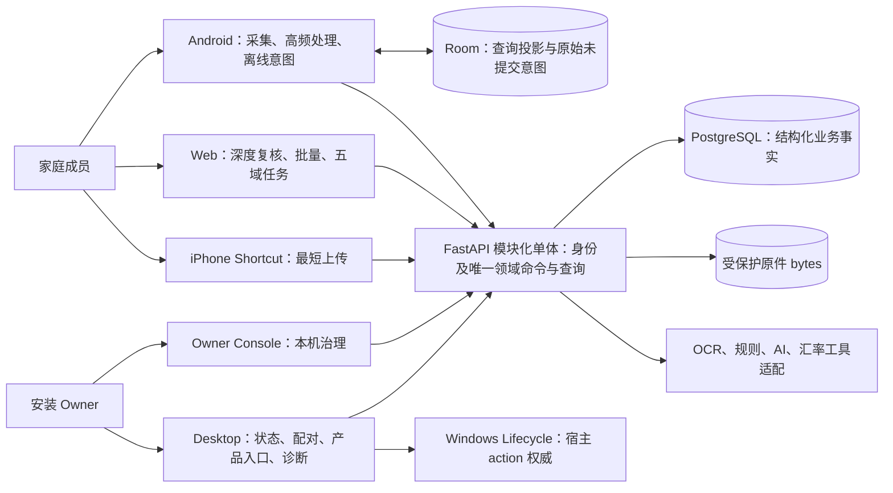

# Ticketbox 当前产品地图与修订规划

完整摸排日期：2026-09-19，施工状态更新于 2026-09-28。主线、未合并候选与日常安装分开核实；具体版本、来源和证据边界见[事实记录](../qualification/2026-09-19-product-assessment.md)，后续片的实现与资格证据见各当前合同及对应 PR。本图保留能力、状态、剩余用户结果和施工关系，不重复承载工程运行记录。

**产品已经远超截图记账：五域都有真实业务实现，跨域关联、外币、纠错、离线提交和恢复已有大量可保留成果；完整产品与 exact Internal Beta RC 尚未完成。** 主要欠账是财务解释的一致性、完整历史与业务续办、数据可携带性、持续使用的跨端连续性，以及最终真实场景资格化。不能把这些缩成几个页面或最近几个 PR。

本图负责现状、差距、保留条件和施工顺序；[用户旅程](TICKETBOX_USER_JOURNEYS_CONTRACT.md)及已有纵向合同负责详细语义。历史资格记录继续保留，失效的“当前下一步”由本图替换。本图是从有效目标推导的施工地图，不是第四份架构，也不增加运行时或证明体系。

2026-09-29 收入／消费目标整组已完成并转入预算、月度安排与固定支出任务组。#464 最终源 `0a173413` 与合并主干 `9085561d` 的 CI、CodeQL、三个实际 Connected 分片及同账本真实 Web／Android 旅程均通过；最终收入 6300、目标 2500 均在用，保留 11／9 份修订，Expense／Budget 为 0。完成范围和下一组已核准缺口见下文；这不代替最终 RC artifacts 与全产品演练。

## 1. 目标、版本与阶段

| 依据 | 本次确认的身份与适用范围 |
|---|---|
| 当前 Goal 全文、后续用户裁决 | 方向、边界和授权的上位依据。Codex 主导架构、产品、实现、美术、交互、验证和集成，自行安排施工，不逐片等待确认。2026-09-19 再明确：按原完整目标摸排，能力只能加强。 |
| 2026-08-26《产品与全系统架构合同（当前版）》Rev 2.0 | 两份顶层架构之一，正式继承 8.17 完整产品并补齐容器、领域、权威和数据流。五域、共享承重、S/D/F/C/Q、Promote/Consolidate/Extend 保留。 |
| 2026-08-26《Windows 与数据生命周期架构合同（当前版）》Rev 2.0 | 第二份顶层架构；8.24 Fresh-G2 是纳入其中的 action profile，不取代产品目标，不自动授予其他生命周期资格。 |
| 2026-08-26《G2 后产品完整化与 Internal Beta 施工合同》 | 当前阶段执行合同。Fresh-G2 关闭后完成产品 P1/P2，再冻结并演练 exact RC 的 P3，随后进入观察。不是第三份架构。 |
| 2026-09-01 公网连接任务裁决 | Stage 1 只读观察及产品投影；Stage 2 宿主 mutation 仍受明确条件约束。配置 URL、Tunnel 正常不能代替产品可用。 |

本次读取 Gmail 最终邮件并核对附件包及三份文件哈希；所检索后续邮件未发现替代这两份架构的新版本。旧 ADR、路线图、助手归纳、测试名和 PR 都是线索或实现证据。

2026-09-20 更新的 Goal 已移除旧安装版本、未闭合 #404 和旧交接顺序；完整目标与持续授权保持有效。当前无须改变既定目标或边界即可推进本规划。

**保留与加强是交付条件：**每片明确原来能完成的任务、权限、币种、历史、离线、冲突和恢复路径；替代路径承接全部有效能力，再以更少重复输入、更清楚结果或更强恢复证明增强。旧实现在真实消费者迁移后物理退役。不得以删入口、缩支持范围、丢历史、改成只读或仅增加拒绝交差。

**2026-09-26 用户补充：现有实现不等于正确模型和流程。** 施工须主动发现缺失任务、错误业务模型及断裂链路，按完整产品目标纠正模型、补全能力并改善操作体验；不能只给现有页面加入口或把当前行为写成合同。保留的是用户有效能力和业务事实，不是已证实错误的内部模型；在既定边界内由 Codex 主导修正，确需改变产品目标或边界时再单独提出裁决。

**长期同级标准：**系统可以复杂，因为真实业务本来就复杂；实现不能跟着复杂，复杂性要被压缩、收口、封装。允许问题域复杂，不允许复杂性在代码库里到处扩散。ACK 丢失、OCC、绑定切换、离线恢复、跨端一致性的必要复杂性由清楚的领域 Owner 和责任边界承担；入口、消费者与恢复路径复用同一规则，避免重复状态、平行 writer、桥接层和多处维护。不能为表面简单删能力，也不无条件禁止合同内必要的模型调整或把责任堆成另一个巨石。文档同样分责：本图保存全局原则，直接合同记录本片如何落实。

## 2. 真实产品与数据关系

五域回答用户问题：收件“有什么待处理”，流水“实际发生什么”，往来“和谁未了结”，计划“怎么花、存、还”，洞察“发生什么变化”。它们不冻结 tab 数量，也不是五个微服务；Owner 与 Desktop 属于 Backstage。

```mermaid
flowchart LR
    U[家庭成员] --> A[Android：采集、高频处理、离线意图]
    U --> W[Web：深度复核、批量、五域任务]
    U --> I[iPhone Shortcut：最短上传]
    O[安装 Owner] --> C[Owner Console：本机治理]
    O --> D[Desktop：状态、配对、产品入口、诊断]
    A <--> Q[(Room：查询投影与原始未提交意图)]
    A --> B[FastAPI 模块化单体：身份及唯一领域命令与查询]
    W --> B
    I --> B
    C --> B
    D --> B
    B --> P[(PostgreSQL：结构化业务事实)]
    B --> F[(受保护原件 bytes)]
    B --> T[OCR、规则、AI、汇率工具适配]
    D --> H[Windows Lifecycle：宿主 action 权威]
```

| 真实业务链 | 已有事实、意图及关联 | 必须保留的意义 |
|---|---|---|
| 证据成为流水 | 上传请求/CSV 行 → 原件及来源 → OCR/规则建议 → Pending Expense → 人工确认；ExpenseRevision 记更正，ExpenseOffsetFact 表达退款/冲正 | 建议、工作流和事实分开。保留商品项、分摊、分类、商家、标签及来源；人工确认仍是事实入口。 |
| 消费产生往来 | Expense/Split → BillSplitInvitation → 接受后的关联流水及成员 Debt；外部欠款/应收由 Debt 命令创建 | 保留对方接受、经济事件身份、可见范围和防双计数；跨账本关联不是两笔独立消费。 |
| 往来被了结或纠正 | Debt + Repayment/RepaymentVoid + Adjustment/Forgiveness/Void → fold → 余额、状态、还债目标进度；#427 以双方提议/接受事实关联原债与最多一笔返还债 | 余额由事实推导。还款、退款、免除和作废分工；重议保留原份额与已发生资金，双方明确接受后追加事实，不直接改余额掩盖未闭合业务。 |
| 计划读取与关联实际发生 | confirmed stream → Budget/开销 Goal 的执行进度；Debt fold + DebtGoalLink → 还债目标；IncomePlanRevision → 收入预测 → Budget/Advisor；Recurring Series → Occurrence ↔ 已确认 Expense 的显式关联 | 各计划不共用一种付款关联。固定支出义务月份与付款月份独立，显式关联后解除预留。收入计划和储蓄试算不代表到账或余额。 |
| 回看并继续处理 | 事实流 → 总览/月报/趋势/目标/预算/数据健康/CSV → 原流水、原往来、原任务 | 查询可重建，不成为第二 writer；金额、币种、期间及关联一致。 |
| 家庭和设备协作 | Account/Ledger/Member/Device/Session + Pairing/UploadLink/Invitation；Outbox 绑定主体、账本、版本和 key | 后端决定权限；receipt 不是新财务事实。撤销、换账本、换 token 不重新归属旧意图。 |
| 数据离开安装 | 分析 CSV、原件、历史和关联；已有完整备份 owner、manifest、原件校验、restore lineage 零件 | CSV、数据库归档、可携带产品数据、可恢复整套安装分别核实；现成零件继续复用，不互相顶替完成声明。 |

## 3. 能力现状与保留条件

“已成链”表示所列任务已有集成实现和相应证据，受其覆盖边界约束；“局部”表示有可用能力但整项不完整；“未验”是证据不足，不直接认定功能缺失。按适用的 Surface/Domain/Foundation/Continuity/Qualification 判断短板，不伪造产品总完成率。

能力核准统一按适用的 **configured → enabled → reachable → operable → observable** 检查真实任务：用户能找到入口，完成有效配置与启用，实际执行，理解结果并从失败中继续。这是通用核准标准，不要求新增五种状态对象或健康引擎。

| 用户能力 / 主要端与 owner | 已成立且必须保留 | 仍需加强或核实 |
|---|---|---|
| 上传、分享、待处理；Android/Shortcut/Web，Capture/Expense/Assets | 服务端原始上传身份/回执及原单识别任务，Android 文件暂存/UploadIntent 续办，识别草稿、人工复核、批量确认/拒绝、权限和重复提示已有实现。#424 已接通 Web 原提交键、身份绑定、IndexedDB 原文件、重载/断网及 ACK 丢失续办；无脚本或无设备身份仍可在线上传，并明确无法跨页保留文件。 | 保留两端已有原文件及原提交恢复，不再把 Web 图片续办列为缺失或重建第二个 Owner。最终 RC 仍补实体 Android/iPhone 的断网、原图及 Shortcut 错误分支，保留最短入口；单片续办不冒充 OS 中断和最终 artifact 演练。 |
| 通知采集与提醒；Android notification / draft owners | 可选通知消费/还款草稿、包名白名单、投递去重及原账本绑定；消费与还款分流，仍待人工复核；已有预算/备份等提醒保留。 | 核实系统授权、原任务深链与续办；还款草稿当前不发“去核对”通知，不能误导到消费待处理页。按真实任务补便利性，保留默认隐私与关闭能力。 |
| CSV 与外币账单导入；Web，CSV batch owner | 保存批次与原行续办；[外币导入](TICKETBOX_FOREIGN_BILL_CONTINUATION_CONTRACT.md)按原单日期取得[历史汇率](TICKETBOX_HISTORICAL_FX_CONTINUATION_CONTRACT.md)，保留原币、汇率来源及实际发布日，缺失可见且能逐单补率继续。原生购买/退款/退单/冲销识别、同账本重复匹配、缺原单复核已在主线；普通 CSV、失败行导出及[根流水/退款的冻结 FX 导出](TICKETBOX_COMPLETE_FX_EXPORT_CONTRACT.md)继续保留。 | 授权范围内的完整可携带出口已随 #425 合入；最终 RC 仍重演缺汇率、历史日期和跨端回原任务，不把已闭合能力再列为缺失。 |
| 手工记录、编辑、确认；Android/Web，Expense command + receipt | Web 原始草稿/key/绑定；Android 原子 admission、receipt 和身份提升；pending 保存/确认/拒绝/撤销/重识别已进既有持久提交路径。 | 浏览器/OS 中断、服务端已成功后本地接收失败等完整演练仍需完成；不能再列为“仍在线直写”。 |
| 已确认事实、更正、退款、冲正；Facts/correction/offset | 原币/本位币、冻结 FX、历史更正、偏移事实、原单追溯、商品项/分摊和复合更正保留。[账务日历](TICKETBOX_ACCOUNTING_CALENDAR_CONTRACT.md)统一默认月份与事实归属日，贯穿预算/目标/报表/导出；显式月份、日期精度和冻结原意图继续有效，OCR 配置或设备月份不能暗改已确定的账务解释。 | 原件状态、同账单续办与授权范围内的完整出口已接通；最终 RC 仍核实各默认月份消费者。财务更正与回收站恢复继续分工。 |
| 币种选择与换算恢复；Money/binding/FX | 显式初始币种、可改默认、记录金额不改标签、多币种精度、历史/单据汇率续办、外币固定支出创建。 | 补全期间/计划/导出消费者的一致性；保留缺汇率时的输入和原任务，不能统一 CNY 简化。 |
| 欠款、应收、拆账、还款；Relationships，Android/Web | 外部往来、成员拆账接受/结算、幂等还款、调整/免除/作废事实和 fold；原提交重试、债务账单图片识别的原家庭身份绑定、还债目标关联；识别图片为瞬态建议输入。已合并的 #426 补齐八类时间线、分页与关联还款定位。#427 接入双方新约定、反复重议、已付后的返还、跨账本应付发现和三类约定历史，保留原付款、免除、原币和实际确认额。 | exact 云端、合入和独立主线资格跟随各自 PR 记录；Android 新约定未入队表单目前只在任务 ViewModel 保留。共同经济身份、fold、无双计数及个人核对便利性仍按真实场景加强。跨账本目标关联须同时处理方向和目标读者，不能由现有地图推导扩大个人关系的共享范围，见下方补核。 |
| 预算、收入、开销/还债目标；Planning，Android/Web | 简洁预算初用、分类/总额、月度及单次收入计划与不可变 revision、两种目标、还债关联/进度、归档/恢复保留。账单确认、更正、退款/冲正在服务端接受并形成权威投影后，驱动 Android 计划总览、预算、目标、收入、固定支出与洞察[重读真实查询](TICKETBOX_FINANCIAL_READ_PROPAGATION_CONTRACT.md)，保留正在编辑的表单、付款选择和原 OCC。#438 已合并贯穿 Plans/预算/Insights 的预算持久读取。 | 预算建立、修改、归档与恢复的不可变历史已随 #434 接通 Web/Android 分页及完整出口；#441 已补齐开销目标的不可变定义历史、两端入口与完整导出；#442 已接通 Series 的不可变定义回看、新期次的实际记录依据及未知旧依据表达；历史入口不等于持久离线列表。固定支出冷启动读取已由 #444 补齐；往来冷启动读取已随 #446 合并，收入编辑已由 #447 补齐，收入新建已随 #450 收口；消费目标续办 #451 已收口，还债目标 #452 已收口。最终 RC 重演前后台接受、失败及跨端返回，不能以发出通知代替消费者更新。 |
| 储蓄与备用金；Planning/预算建议 | #436 已将原参数提升为独立月度安排：保存与不可变修订、Web/Android 原入口、Android 原币草稿与 Outbox、显式试算、建议的实际输入和安排缺口。缺失与明确零分开，旧预算与本地计算保留，AI 仍可选。 | #436 已合并并独立验证 main；#437 已合并双币种试算/AI/补率/保存、两处全局原安排恢复和已知修订离线历史，源提交三项资格通过，独立 main 验证见对应 PR。它表达计划留出，不代表实际存款、到账或账户余额，不新造银行账户产品。 |
| 固定支出到付款；Recurring/Expense/Outbox | [外币固定支出与期次履约](TICKETBOX_RECURRING_OCCURRENCE_CONTRACT.md)已接通：缺付款时记录真实付款，义务月份与付款月份独立，显式关联回原期次后不重复预留；有效冲正会使付款失去资格、回到待核对并恢复预留。[原表单与付款选择续办](TICKETBOX_RECURRING_FORM_CONTINUITY_CONTRACT.md)保留；[收入计划](TICKETBOX_INCOME_PLAN_CONTRACT.md)只形成预测和预算输入，不等于到账。 | 核验退款/冲正、后台接受及跨端回看的完整履约旅程，补实际发现的续办缺口及修改历史。建议候选与金额异常读取已冲正付款的问题分别由 #457/#459 实际复现并修复，共用原有效付款规则；#459 已合并，源与独立 main 资格均通过，三个 main 原生分片实际成功。 |
| 搜索与资料库；Reference，Web 深度/Android 轻量 | 分类偏好、商家别名、标签改名/合并/撤销、规则预览/应用/回滚、重复处理和历史引用有既有 owner；分类删除已保护规则、预算及开销目标引用。#448 已将未使用标签筛选及三种整理动作的提交时保护迁入 Web 原标签页，保留在用合并目标、原 OCC/撤销/账本权限，已退役 Owner 重复页；合并 main `8e5529e` 已独立通过 CI、CodeQL 和三片实际 Connected。 | 分类缺口是可操作的引用解释与导航，不重造已有删除保护。保存视图 #449 已按 exact 源资格合并；原查询保存条件、资料库发现和失效标签修复已接通，合并 main `609448a9` 的独立 CI、CodeQL 和三个实际原生分片已通过。 |
| 回顾、报表、数据健康；Insights | 真数据总览、月度净额、分类/趋势、计划状态、事实下钻、CSV 事件/FX 字段；安装版总览和预算实际可对照。 | 已确认流水的保存查询条件已由 #449 接通，卡片布局偏好仍与查询条件分开；其他报告查询需求按真实任务继续核准，健康状态未覆盖原件 bytes 损坏和完整关系历史。 |
| 离线与跨端；Room/Outbox/query owners | [直接还款](TICKETBOX_DIRECT_REPAYMENT_CONTINUITY_CONTRACT.md)及已接入财务命令在联网前冻结原 key/body/主体与账本绑定/OCC；协议或回执不匹配、ACK 未知不把未证实意图标为 Done。保存、重试及[拒绝 Undo](TICKETBOX_PENDING_COMMAND_ADMISSION_CONTRACT.md)沿同一原提交与原接受回执恢复。Expense/统计、[Goal 列表/详情](TICKETBOX_GOAL_OFFLINE_READING_CONTRACT.md)和 #438 Budget 已有持久查询读取；SavedState 草稿与 Room/Outbox 原提交分别保留。预算按完整 binding/month/timezone 保存查询及原时间，接受保存只退役旧查询，本地清理失败保留回执并提供读取恢复；撤权同步撤下保留页面的旧查询，提醒只读新鲜结果。 | 固定支出 #444 已补齐已读查询的冷启动回看与撤权；往来 #446 已完成源资格并合并，收入编辑已由 #447 补齐，收入新建已随 #450 收口；消费目标续办 #451 已收口，还债目标 #452 已收口；页面内存、草稿和 Outbox 不能冒充查询快照，见[查询与草稿边界](TICKETBOX_USER_JOURNEYS_CONTRACT.md)。继续补跨端重入、过期/撤权、混合版本和 OS 中断，不另建队列、不靠清缓存解决。#438 合并前及合并后 main 的独立 CI、CodeQL、Connected 三个实际原生分片均已通过。 |
| 首用、家庭、权限；Identity + Desktop/Owner/客户端 | Owner 接入、配对、明确币种、邀请原代码续办、成员/只读角色、设备/上传能力撤销、账本隔离；公网管理和重复 Owner 回收站已退役。 | exact RC 重演各角色、重入、撤销；Shortcut 旧 bootstrap 文档需对齐当前首用。恢复代际相关限制按原 HOLD。 |
| OCR/AI/FX/后台任务；provider/worker/task | 识别热配置、原单任务续办；Advisor 区分配置/同意/角色/实际调用；FX 已有 worker/lease/最近结果。 | #443 已合并接通 Web 原单 OCR 重试，保留原编辑与同请求失败续办；#445 已合并复用既有 account/ledger 任务查询，在待处理页提供最近上传结果、安全错误说明、继续观察和经验证的原单链接，Owner 只导航到该业务上下文。单片资格与完整 Backstage/RC 分开记录。 |
| 原件、数据出口、宿主；Assets/Portability/Windows | 鉴权原图、上传 digest、受限 resolver、缩略图/清理、备份原件 hash 与 inventory；#424 已交付完整性状态、同账单补回、旧件核验和持久清理续办，主线独立资格通过。#425 已交付含历史、关系和原件的授权完整出口。Fresh-G2 关闭，Desktop 诊断已有实现。 | 整本归档账本的只读直接导出仍待增强；全局孤立原件处置及当前阶段可执行数据安全边界继续按实际风险闭合。完整 restore/upgrade 等继续 HOLD。 |
| 消费级美术与便利性；各端消费者 | 已完成的美术、Paper/Midnight、空态/表单、快捷键/批量/少步骤入口和细节修正保留，详见[既有美术与便利性片](../superpowers/plans/2026-09-05-consumer-art-convenience.md)。替代表现层先承接权限、原始输入、批量、冲突和恢复，再物理退役旧资产与组件。 | 消费级美术与真实任务减负仍是最终要求：全五域窄屏、键盘/触控、焦点/a11y、浅深色、自定义背景及复杂错误/离线态继续整体收敛，并核对步骤、重复输入和跳转负担。#372 仅是债务键盘候选，已完成片不替代整体 RC。 |

## 4. 改变施工优先级的差距

**Web 收入新建 #458、编辑续办 #460 均已合入并完成独立 main 验证。** 新建冻结源 `c09325de` 的实际 Edge 模板刷新丢原值、JPY、九月及原 key（job `108902104830`）；真实 PostgreSQL 保存缺原 ACK，换设备后旧稿误写（job `108902104210`）。最终源 `1623234f` 的实际浏览器、真实数据库、CI、CodeQL 和三个原生分片已通过，保护合入 main `6df049ec`。该主线 CI `36425097988`、CodeQL `36425097828`、Connected `36425098021` 已独立通过，三个原生分片实际成功。CI 初次因未取得可信 NVD 产物失败；既有刷新 `36427199902` 成功后，仅定向重跑 SCA 及下游聚合通过，没有改 CI 或缩减安全检查。新建已成立的原稿、未知结果重试、显式准备/本地放弃及原生表单能力保留。

编辑冻结源 `43c5230e` 的真实安装会话验证：正确保存了第二条修订却只返回 303（job `108928114318`）；同账号/账本更换浏览器身份后，旧稿仍把 1000 元改成 2000.25 元（job `108928114267`）。随后测试冻结 `0a504263` 在实际 Edge 编辑页刷新时，把原输入、OCC 7 和原 key 换成另一端的已保存值、OCC 8 和新 key（job `108937678331`）。#460 候选沿新建现有消费者扩展编辑，复用 DraftStore、完整身份绑定与原收入 receipt；原稿和最新已保存事实并列，目标计划/月/OCC/key 不随重开改变。权限恢复、归档后核实已接受的原提交、无脚本表单和显式核对准备新修改均保留；共享收入脚本承接两入口，旧新建脚本物理退役。最终源 `34c02aef` 已合入 main `4e611a87`（2026-09-28T13:58:24Z）；该 main 的既有 CI `36432472442`、CodeQL `36432472619`、Connected `36432472466` 已于本次接续直接读取为成功，复用原句柄，没有为交接重跑。原输入与原接受结果能力已保留；完整计划日常旅程和 RC 不由这一片替代。

2026-09-28 Web 计划续办补核：收入、消费目标及还债目标的 POST 失败原输入、原 key/期间保留已经成立；浏览器刷新或关闭后的持久草稿仍需补齐，复用既有 DraftStore 的完整主体绑定、原提交、租约及 ACK，不能重建业务命令。预算原账本 #456 已沿原表单保留机制闭合：冻结源 `78a6395e` 真实会话切换后保存返回 303，核对返回 200 且改成当前账本；修复在读写或核对前拒绝改投，原金额、币种、月份、key/OCC、多项分类及分类返回来源均保留。最终源 `569f0778` 的真实链已通过，证明两边不误写、切回后重试与重放只保存一次；CI `36408598986`、CodeQL `36408598952`、Connected 适用范围门 `36408599682` 均成功，本片原生设备执行按范围跳过，不冒充设备实测。保护合入 main `7a6d21d2e3cd3a526681c88f2bc6db230952cbea`，该主线的独立 CI `36410494955`、CodeQL `36410494992`、Connected `36410494928` 均已通过。没有重建预算命令或浏览器草稿 owner；完整产品施工继续。

**收入／消费目标整组 CLOSED（2026-09-29）：**已沿原 IncomePlan／Goal 命令、修订与查询责任完成读取、历史、建立／编辑、失败续办及实际多端使用。#461 四个 Web 表单共用 `plan-entry.js`；#462 补两端收入历史；#463 补收入持久查询；#464 的实际使用修复收入并发读取互相替换、失败冒充空列表及原生目标金额截短。原 forecast、预算／Advisor、目标进度、角色／账本、分类返回、原币／期间、Room／Outbox、归档及两端回收站继续有效。

最终源 `0a173413`：CI `36474144201`、CodeQL `36474144232`、Connected `36474144205` 三个实际分片、真实同账本旅程 `36474144291` 通过。独立 main `9085561de4b487166ff690a9464c88d4fd489295`：CI `36476172822`、CodeQL `36476172979`、Connected `36476173119` 三个实际分片、真实旅程 `36476172834` 通过；旅程 source／checkout 均为该 main，APK SHA-256 `0cdad696d3992f83450264d7e7db09875a830260c4933ad15e30800ffe9b8ac9`。旅程覆盖交叉修改／OCC、历史、丢回复核实、离线重开续交、归档及两端恢复、成员修改／只读回看、明暗及 Web 宽窄屏。既有服务端／Room 门继续证明各自范围，[#464](https://github.com/xxu29958-jpg/xpj/pull/464) 保存原实际反例与最终资格。

**下一组：预算、月度安排与固定支出的完整续办。**复用已成立的预算／安排／Series／Occurrence 命令与修订，先明确整组余项，再分可审查的实现片；不将试算或计划留出制造为真实付款、存款或余额。

| 整组出口与有限消费者 | 已核实基线和剩余工作 |
|---|---|
| 读取与历史：Web 预算／本月安排／固定支出列表、历史、期次；Android Plans／Budget、BudgetAdvice、Recurring／Occurrence 与三种历史；Insights／Advisor／预算预留／提醒 | 复用 #434–#438、#442／#444 的历史和持久查询。预算历史仍从 `BudgetRepository.history` 直接 GET，重开后离线读取及同绑定撤权尚未接到持久查询；本组先补这一明确缺口。其余既有读取复用当前消费者，实际集成中核对来源／时间、未读页、未知值及接受后失效。 |
| Web 建立／编辑：预算、月度安排、固定支出新建和编辑四入口 | exact main `9085561d` 的真实模板＋Edge 预检已复现四入口刷新后丢原金额／分类／日期和原键，未发送任何 POST。复用 DraftStore 的完整身份、租约及 ACK；预算重复分类行／排除／移除、分类返回，安排报告币种与原输入币种／FX 返回，以及 Series 人工／观察来源必须保留。试算、可选 AI、保存是不同动作。 |
| 原生编辑及恢复：BudgetRoute、BudgetAdviceRoute、RecurringRoute／OccurrenceRoute、原任务与全局同步入口 | 复用既有原币草稿和 Outbox，核对重开、失败／未知回执、原 key／body／OCC、跨月／跨端拒绝与后续新编辑。预算归档／回收站恢复，Series 暂停／恢复／归档及两端回收站同属整组出口；不替月度安排新增不存在的归档语义。 |
| 固定支出到真实付款：Series／Occurrence → 人工确认 Expense → 显式关联 → 预算预留与实际执行 | 复用既有履约、候选来源、金额异常及 #457／#459 有效付款规则。实际核对付款月与义务月分离、关联不重复预留、退款／冲正后失去资格的付款回到待核对，以及两端重读；不创建第二付款 owner。 |
| 实际使用：同一隔离安装的 Web 宽窄屏、Android 原生、明暗及成员／只读 | 最后执行预算／安排／固定支出共享消费者的完整业务链，检查原始修订／回执、原币金额、失败提示和可继续的出口。已有局部门禁不冒充整组实际使用，本组仍开放。 |

本组允许修改上述现有 Owner、查询／草稿接线及直接消费者，退役被替换的在线读取或原稿丢失出口；不新造队列、银行账户或 Windows 生命周期能力。完成依据为实际反例转绿、受影响角色／绑定／金额／期间不变量、exact source 与独立 main 门禁和同账本多端旅程。日常数据、身份和离线意图受保护；最终 artifacts、OS 中断及十八项 RC 演练继续保留。

### 本批 RC 阻断净变化（2026-09-28 起）

按用户新增要求，约 4～6 个有效片后在本图报告：**期初开放、真正关闭、新增或重开、期末开放，以及净减少数**。净减少 = 真正关闭 − 新增 − 重开；同一用户任务和根因在不同端、入口、测试或 PR 中出现时去重。局部补齐、候选修复和 PR 合并不自动计关闭，须证明原阻断后果消失、受影响能力保留，并完成已有合入与独立主线验证。清单去重或纠正误判是口径修正，不能冒充施工消除了问题。这个回报不新增单片合并前置或停工限制。

起点固定为已独立验证的 main `8b346be2`，包含当时尚未合并的 #458/#459；后来的主线变动分别登记。此时**本批已取得实际业务反例的开放项为 2 项**：

| 已核实阻断项（与本图原差距对应） | 起点证据及关闭所需用户结果 | 当前变化 |
|---|---|---|
| Web 收入原任务连续性缺口（起点已核实新建，后续编辑证实同一机制尚未接通） | 实际刷新丢原值/币种/月/key；真实保存缺原 ACK，换设备后旧稿误写。须同一身份恢复原稿、原键取得稳定结果，换身份不误写，失败有可完成的核对出口。 | **已核实关闭 1 项。** #458 新建与 #460 编辑均已合入并完成独立主线验证，原稿、原身份、原 key、稳定回执及显式核对出口成立。统计上合并一项，不把入口、测试或 PR 数重复计收益；后续整组旅程与 RC 仍需实际资格。 |
| 固定支出仍把已冲销付款用于判断（第 3 节“固定支出到付款”） | #457 已修候选来源，但真实当前金额/历史均价仍包含冲销付款。须有效付款口径贯穿建议、金额观察、履约与提醒，撤销冲销恢复、普通退款和正式计划不被误删。 | **已核实关闭 1 项。** #459 的真实冲销/撤销冲销/退款对照及正式定义保留通过；源 `10069092` 与 main `064b08a9` 的 CI、CodeQL、Connected 均通过，main 三个原生分片实际成功。与 #457 去重，只计一次。 |
| 新增：Web 支出目标刷新会丢原稿（第 4 节“持续使用”） | 在 main `6df049ec` 的真实 `goals.html` / `goal_edit.html` 和隔离 Edge 中，新建刷新后姓名/原金额/分类被清空，原 JPY/九月/key 改成当前 CNY/十月/新 key；编辑刷新后原输入和 OCC 7/key 被另一端已保存值、OCC 8/key 替换。2 条实际业务反例，非环境失败。 | **已核实关闭 1 项。** #461 最终源 `6d5aac95`、main `c6c8c1c` 均通过独立 CI、CodeQL、三个实际 Connected 分片。四入口 Edge、原身份/原 ACK 的 PG 链和收入到消费目标集成旅程已通过。main handles：CI `36440647205`、CodeQL `36440647431`、Connected `36440647248`。新建/编辑合并计一项。 |

回收站补核前的上一批局部统计为：期初 2、真正关闭 3、新增 3、重开 0、期末 2，净减少 0；它包含当时尚未收口的收入历史入口与持久读取，不是当前整组进度。随后 #462 已完成独立主线资格，#463 又取得上表四条恢复反例。当前结果以上表实际证据与仍开放的出口为准；旧记录滞后不撤销已成立的代码与验证成果，也不把新增反例或 PR 数直接换算成 RC 倒计时。

**这不是“全产品只剩 2 项”的结论。** 第 3～4 节其余差距仍逐项保留：其他 Web 计划草稿、关系解释与核对、数据安全当前阶段出口、Backstage 连接到任务结果、消费级整体使用和最终 RC 演练。沿后续施工核实为实际阻断的计入新增；尚未验证的范围不能偷偷删除，也不能先伪造失败数量。最终批次回报须同时列出未验范围，不用本批命中的两项代替完整产品差距。收入新建完成不会自动关闭其他 Web 计划续办；最终 artifact 的演练未完成也不会因单片全绿被划掉。

### 财务解释与数据出口

1. **账务日期的共同事实已在主线。** 根流水与 offset、预算、目标、月报和导出采用共享账务日期；账本规则版本、日期精度、原始输入、旧草稿和回执保留，同一事实不随查询时区跨月。无时间证据的历史记录保持可查、可导、可沿原单更正，受影响期间明确不完整，不虚构原始日期。具体实现与资格见[账务日期合同](TICKETBOX_ACCOUNTING_CALENDAR_CONTRACT.md)，单片资格不代替最终 RC。
2. **原生 CSV 的错误解释已修正并合并。** #422 使自身导出的购买、退款、退单和冲销保留种类/方向、原单及冻结金额，已存在事件匹配，缺失事件沿原事实 owner 人工复核和续办；旧 JPY 部分汇率证据仍可保留并补齐。普通支出导入、批次、失败行导出和分析字段保持。原反例未在日常库导入，不能据此声称用户账目曾被污染；分析 CSV 与下述 #425 已合入的完整可携带出口继续各负其责。
3. **原件完整性与同账单续办已在主线。** [原件完整性与同账单续办](TICKETBOX_ORIGINAL_INTEGRITY_CONTRACT.md)接通校验读取、只读状态、同账单补回、旧件人工核验、持久清理及 Web/Android 续办，保留实际原件身份与财务历史。Web 原文件重载、断网及 ACK 丢失续办与 Android 离线准入、原键续办均保留，实际发送校验服务端能力。正常手工无图记录保持有效，历史无摘要原件继续可读且明确未核验。具体资格见直接合同，单片资格不代替最终 RC。
4. **数据主权的授权完整出口已随 #425 合入。** 原有 CSV 未覆盖完整修订、关系、计划、资料库和原件；备份代码不等于可恢复产品。[可携带数据出口](TICKETBOX_PORTABLE_DATA_OUTLET_CONTRACT.md)已接通 API/Web 下载、全部授权状态与历史、账号收件箱/往来、原件及历史回执引用。结构数据使用独立只读快照，余额复用原领域计算；文件缺失不抹掉财务记录，包内分别说明原件状态。实现范围和直接证据见该合同与 [#425](https://github.com/xxu29958-jpg/xpj/pull/425)。整本已归档账本仍受现有会话读取限制，当前由账本 Owner 恢复后取用；无需恢复即可只读带走历史是后续便利性增强，须接通授权和真实入口，不在 #425 临时放开归档权限，也不将该增强另加为合并前置。现有 CSV、原件操作与各端未提交意图保留。Internal Beta 允许的诊断/导出/冷备边界仍需实际闭合，完整 Windows 生命周期不因此重开。

### 完整业务任务

5. **往来不能只见余额和还款列表。** [往来持续使用](TICKETBOX_RELATIONSHIP_CONTINUITY_CONTRACT.md)的 #426 补齐八类时间线；已合并 #427 复用同一 Debt fold 接通双方新约定、反复返还/再付款及其历史，Web 与 Android 均接入原提交恢复。已付与免除分别保留，新份额仍受原单容量约束。原比例退款参考和当前份额分开显示，不能自动重复减账；CSV 保留本账本消费口径，portable 携带共享约定事实及公开引用。这部分实现已进入主线；合同要求的共同经济事件身份、fold 和无双计数，连同个人核对便利性，继续按实际用户任务核准，不能由结算表或补链接替代。跨账本目标关联仍记录为待明确读者与方向的需求，不把个人关系自动共享给目标账本全部成员。
6. **计划不能只剩当前行。** [预算修改记录](TICKETBOX_BUDGET_HISTORY_CONTRACT.md)沿原保存/归档/恢复命令补齐不可变安排、两端分页与完整导出；#434 与后续触摸修正 #435 已合并，主线独立资格通过。#441 的开销目标与 #442 的固定支出定义历史已合并；#436/#437 的储蓄和备用金已具备持久安排、双币种试算、保存与原安排恢复。下一步补既存查询和草稿连续性，联合收入、已花和预留解释“花、存、还”；计划留出不代表实际存款、到账或银行余额。
7. **资料库与回顾有缺失任务。** 分类引用 #454 已接通原规则/月份预算/目标及回原分类继续删除，源资格通过并已合并，独立 main 验证见后文。保存视图 #449 已取得“原流水可查但无保存入口”的真实业务反例，已沿原已确认查询接通保存、资料库发现、重开、修改/删除、失效标签修复及完整出口；保存条件而非结果，账本共享、固定/当前月和跨期范围明示，财务事实不变。最终源 `f61bb93d` 的 CI、CodeQL 与三个实际原生分片通过，已合并为 main `609448a9`；该主线独立 CI `36361290928`、CodeQL `36361290942`、Connected `36361290971` 也全部通过，三个原生分片均实际成功。其他保存查询需求仍按完整用户任务核准，不把首片冒充完整报告能力；无需重写 Dashboard 或造通用报告引擎。

### 持续使用

8. **Outbox 不等于草稿和离线读取齐全。** 已合并 #438 接通 Budget 持久读取与三处真实显示，保留完整预算、未知执行值、原时间及原命令。收入原编辑草稿已在 #447 收口，新建任务续办已随 #450 收口；消费目标 #451 已收口，非货币还债目标 #452 已补齐原稿与原创建续办。保留已合并的 Debt 持久查询，明确过期、撤权、冲突和重入。Debt 详情的整笔作废和还款作废已随 #439 转入原提交恢复并退役直接 writer；往来偿还方式 #453 已取得三端实际业务反例并沿原提交补齐连续性，源及独立 main 均已通过资格；旧 direct-only 路径已退役。保留已成功命令的结果，刷新失败另给重试，避免用户再次提交。
9. **Backstage 最后一段不足。** 接通 OCR 配置、实际任务、原单结果和失败续办；复用 AI/FX 已有链路。原先上传识别失败后的提示要求打开原账单重试，但完整页和抽屉都没有操作入口，已用模板业务反例确认并修复。#443 在原凭证区接通独立识别提交，复用 API 的同一事务 owner，失败继续同 key/OCC；结果另页显示当前账单，原编辑的币种、日期、输入和提交不被消耗。最终源及合并 main `33f73f64e76459af0f6786a2f4953fa0e84c1c3e` 的 CI、CodeQL、Connected 均独立通过，两轮各自三个实际原生分片成功；数据库失败及队列繁忙也保留同请求重试。关闭上传页后的近期任务发现 #445 已完成并合并为 main `3068422942c686335b1d782084f88a3e30f731e5`；最终源的真实数据库、CI 与 CodeQL 已通过，Android 按范围跳过，该 main 的独立 CI、CodeQL 和三个实际原生分片已通过；复用既有 account/ledger 范围内的任务查询、进度入口和已验证原单关联，不把同步手动重试伪称后台任务恢复，也不扩大 Owner 的任务可见范围。连接健康分清配置、可达、身份、权限和实际任务，Tunnel 状态不代替产品结果。
10. **全产品实际演练未完成。** 云端 Connected 和既往实机证据只覆盖各自范围；本次旧模拟器、缺席的实体 Android/iPhone 不算当前实机证明。剩余角色/系统中断/宽窄屏/exact RC 明列，不以未验否认功能，也不增全项目停工门。

## 5. 继续、调整和退役的裁决

| 对象 | 裁决及能力保留条件 |
|---|---|
| 领域 owner、Outbox、事实流、receipt、revision、原件/provider adapters | **继续加强。** 复用唯一责任点；复杂性收口，迁移全部真实消费者。 |
| “#404 未完、pending 未持久化、外币 recurring 无创建入口、付款不能回原期间、#407 未落地” | **从待办退役。** 描述已落后主线；保留成果，检验完整旅程余项，不重复实现。 |
| 已关闭 #415 | **有效实现与独有验证已完整承接。** 原币创建恢复实现经 #416 及后续增强进入主线，独有原生恢复测试由 #442 原样保留并通过。冗余 PR 已关闭，原分支保留，不整包重复合并。 |
| 草稿 #372 | **保留交互候选。** 在 current main 的键盘、滚动、退出/恢复上验证后采用有效部分，保持债务提交语义，不拿旧分支作基线。 |
| 旧 #405/#411 和本地交接 | **保留历史，取消当前排程权。** 以 #412/#414/#416/#419 等实际整合结果识别余项；保护脏树和临时证据。 |
| Owner 孤立标签清理 | **已迁移并物理退役重复入口。** #448 由 Web 承接未使用筛选、原生表单、整理保护和撤销，往返保留筛选；仅退役原 Owner 标签页面、路由和导航，其他管理/只读能力保留。冻结源 `937e8793` 的独立 PostgreSQL 事务证明旧清理会改写同时新建的 1 笔账单。原标签服务现协调清理与记账/镜像修复，保留原标签身份；清理先行后正常重新使用，记账先行则清理拒绝。最终源及合并 main `8e5529e` 均已通过现有资格，main 的桌面一次具体失败与定向重跑成功记录在施工证据中。 |
| 已退役直接财务 writer、Owner 回收站、公网管理 | **保持退役。** 合法当前消费者承接任务，不因旧测试/导航/新外观恢复第二 owner。 |
| 旧 v0.5→v1.0 主控与截图总目标叙述 | **标历史并指回本图。** 不再重设目标、阶段或门禁；现有大批量、商品项等能力保留，规模声明按真实边界核实。 |
| #420 后泛化 CI/地图工程 | **不列产品先手。** 使用现有 exact-head 工程地图和云端门；真实阻断交付时才最小修复。 |
| Windows | **Fresh-G2 保持 CLOSED，既定 HOLD 保持原条件。** 无资格 action 不出假按钮；产品出现可执行阻断只解必要范围，不加“先完整修 Windows”限制。 |

## 6. 修订施工顺序与可交付结果

按当前风险/依赖安排，新反例可局部调整，不按五域或架构章节机械排队。每次完成一个真实纵向任务，同时改善入口、结果理解和续办；其他缺口继续留在本图。先产品能力完整，再剩余美术交互，最后 exact RC。

当前施工：#421～#427 的产品摸排、CSV 续办、账务日期、原件、完整出口、往来时间线与拆账约定均已合并；随后 #428～#433 为 CI B 轮实现。用户 2026-09-26 明确回到产品、停止 CI 改造，随后 #434～#442 已依次补齐预算与目标/Series 历史、持久月度安排、预算离线读取、往来作废和原会话续办。#443 原单 OCR 重试与 #445 重开后的任务发现均已合并；#444 已按真实原生反例补齐固定支出持久读取与撤权并合并；#446 已补齐往来、应付/应收、详情和活动的已读查询与原操作恢复并合并；#447～#450 已收口收入编辑续办、未使用标签整理、保存视图和收入新建续办。#451 消费目标创建也已收口，#452 还债目标创建也已独立收口，#453 往来偿还方式、#454 分类引用回原任务、#455 还债目标原任务呈现、#456 预算原账本和 #457 周期付款候选均已合并；#458 正补 Web 收入持久草稿与原回执续办；其余原始草稿、资料库与整体体验继续按真实价值推进。完整五域、Backstage、保留条件和下列终点继续有效；CI 性能余项不成为产品施工的前置条件。

| 顺序 | 完整用户结果、复用与依赖 | 退出条件与保留要求 |
|---|---|---|
| 1. 财务回看与数据带走 | 先闭合自身 CSV 再导入的语义、原单/重复识别和续办；随后统一根流水/offset/预算/目标/报表/导出的账务日期。附件完整性与数据出口沿现有事实/原件/备份 owner 补齐。 | 用户能解释方向、来源、日期、FX 和同一事件；换端/查询时区不改历史，重试不造第二事实。保留并加强普通导入、批次续办、完整分析字段、原图；Beta 数据出口与恢复边界可实际执行。 |
| 2. 往来与计划的持续使用 | 完整时间线、拆账后退款续办；预算/目标/series 历史；持久储蓄安排；收入/固定支出/付款/目标统一回看。复用 debt fold、修订和关联，依赖稳定时间意义。 | 双方看懂为何未了结且能继续；改计划可回溯，“花、存、还”都有安排。保留双边权限、外币、还款/履约，退款不自动改约定。 |
| 3. 跨端日常工作与 Backstage | 离线读取、原始草稿、跨端重入、成功/刷新失败分离；OCR 结果/原任务；分类引用和保存视图；首用、角色、Shortcut 文档对齐。按原 owner 施工并移除被替代 surface。 | 中断后回同一任务，旧意图保留主体/币种/期间；拒绝与离线可区分。配置到结果可理解，失败可继续，操作更省；告警数量不是便利性。 |
| 4. 消费级美术与整体交互 | 基于真实内容收敛层级、控件、图标/插画/空态/背景、字体颜色、焦点/动效、浅深色/自定义背景；实际验证 Web 360/768/1440 和 Android，采用 #372 有效增强。 | 键盘/触控均能完成任务，批量/快捷键/默认值/少跳转保留；复杂权限、错误、冲突、离线态同样可用。迁移后删旧视觉 owner；当前配色/参考图不冻结设计，已否决的绿色帽子方向不回流。 |
| 5. exact Internal Beta RC | P1/P2 完成后冻结 main/tree、Setup/APK/manifest/schema/依赖/profile；按阶段合同完成 clean Windows、五端分工、数据/身份/附件/intent、重启等 18 项演练。 | 证据属于最终 artifact，必要后台与普通用户恢复可用，非阻断限制明确；保留 Windows HOLD 后进入观察。CI 全绿或单片完成不冒充 RC。 |

**2026-09-27 当前施工先手：**预算历史 #434、触摸回归修正 #435、持久月度安排 #436 及其连续性补齐 #437 已合并。币种解释、原安排核对入口和已确认修订的离线历史保留保存/试算分工、原始草稿与不可变回执；缺少中间修订的缓存不冒充完整历史。#438 最终源 `95d7f0a403c1f8a0fce7ebcb87f64cbae82b19f9` 的现有门禁及三个实际原生分片通过、直接审查问题解决后，已合并为 main `98005ca3cab7a09583a0ac792d309801ca3c46bb`，该 main 的独立 CI、CodeQL、Connected 三个实际原生分片均已通过。Budget 按完整绑定持久读取贯穿 Plans/预算/Insights；提醒只依据新鲜查询，草稿和 Outbox 不成为查询缓存，迟到旧查询不得覆盖已接纳的新结果。

#439 沿已取得的业务反例补齐整笔作废与还款作废的原提交恢复：两端保留原原因、目标、key/OCC/绑定；原接受结果与事实同事务保存，后续付款或查询故障不能改写它。Android 复用 DebtWrite/Room/Outbox，Web 复用原草稿、Web Lock 与 ACK 责任；作废没有金额，不伪装成零金额还款。详情和全局入口能继续原提交，旧已接受但没有原回执的记录明确待核对。替代的直接作废 writer 退役，真实还款、调整、时间线、双方约定、成员权限及原币出口保留。最终源的 CI、CodeQL、Connected 三片已通过，直接审查问题已解决并合并为 main `4608863171cbef4ddf4ba98e93725bbed06da59a`；该 main 的独立 CI、CodeQL、Connected 三片也已通过。

已合入的固定支出 Series 历史保留。往来查询冷启动已由 #446 补齐；收入/目标原始草稿、往来类型修改的原提交连续性、资料库与 Backstage、消费级体验及 exact RC 仍在完整终点内。#440 接续既有还款/调整的原会话归属缺口：原 payload 已保存 origin session/revision，候选使四种 DebtWrite 发送、原记录展示及恢复复用同一绑定校验；新会话不能接管旧意图，正常凭据刷新可继续，原记录可读且可明确停止本机追踪，不靠丢弃旧意图处理。反例与最终资格单独记录在[直接还款连续性合同](TICKETBOX_DIRECT_REPAYMENT_CONTINUITY_CONTRACT.md#original-logical-binding-follow-up--2026-09-27)。这些任务按真实用户价值继续推进，不挂到 #438 的合并门上；已有读写、原始草稿、回执、历史和恢复能力不能缩水。已成立成果不重做，正常验证沿用现有门禁，不再开展 CI 优化工程。

每次改变一个业务语义或 Owner，施工前后均覆盖入口、消费者、旧成功出口、持久化、协议/恢复和直接验证生产者。**没有证据证明不受影响的，不能默认跳过。** 高风险事实/身份/原件用最小充分反例及 exact SHA 云端资格；文档/局部外观按对应风险验证。主审、定向回归、final-head 复核满足后收片继续，不用无关矩阵拖延交付。

开销目标修改历史 #441 已合并：原创建、修改、归档和恢复定义由现有命令事务保存，两端可一点击达，编辑原文与原提交保持；可携带出口包含全部定义。旧数据只记录实际可证的起点，不能虚构更早历史或把当前执行进度当作过去事实。最终源 `d9a11515d3b5815b187f635af1a6d3d4b0d072a5` 与合并 main `780797b2cb1494c015877631135a0e05a5fe779f` 的 CI、CodeQL、Connected 均已独立通过，两轮各自的三个实际原生分片均成功。固定支出定义历史由下述 #442 承接；其他计划连续性及后续全产品任务继续保留，不以此片代替。

往来读取 #446 已补齐原 guarded GET 没有持久查询的问题；通过真实主导航、Retrofit 和磁盘 Room 验证在线读取、重建后重新进入原页面及断网回看。当前补齐账本往来、个人应付/应收、详情和活动的持久查询，保持跨账本当事人的脱敏范围及原币、原时间、原修订。还债目标选择器、还款捕获箱、记账/固定支出币种属于实际消费者；成员提案和拆账预览继续按原职责在线读取，读取拒绝共用同一权限责任。共享撤权与单笔不可见分别撤回实际范围的读结果，保留原输入和离线提交；旧输入不得借刷新后的 OCC。Outbox 接受结果在原 Done 事务内退休旧读取；直接操作及接受拆账邀请在派发前持久保存可撤回的查询屏障，明确拒绝保留已读记录，未知结果与接受后清理失败不能让旧记录在重建后复活。已读来源与业务提交资格各自表达，不用缓存冒充新鲜事实，也不取消原来支持的离线操作。该实现已在最终源及合并 main a97f681e 独立通过 CI、CodeQL 与三个实际原生分片；后续原始草稿、资料库、Backstage、消费级整体体验及 exact RC 均保留。

## 7. 边界、未知项与终点

**收入原编辑草稿 #447 已合并：**冻结源 `ec5aa11b67224af7d393e9e0f3a090be87ce50a5` 已取得实际业务反例：同一身份权限变化使 Android 丢掉原日元输入和在途结果，Web 的写拒绝没有返回原表单。实现复用原编辑 ViewModel、系统 SavedStateHandle 和现有 Income/Room/Outbox；保留原文、币种、原月份及 OCC，同身份只读期间禁止新写但接续原接受结果。返回、滑走和系统保存状态恢复保留原草稿，明确取消才丢弃；完整身份切换立即隐藏旧表单，迟到读取不把它带给新身份。系统旧快照恢复时，已发布的完全匹配原提交继续归 Room 所有，不生成第二条命令。Web 写权限拒绝保留原表单、key、期间及显式核对动作，恢复权限后沿原任务继续。最终源 7f767d05 与合并 main 45ebec82 的 CI、CodeQL、Connected 均独立通过，每轮三个实际原生分片成功；真实系统保存状态恢复仍不冒充 OS 杀进程演练。收入新建、目标原草稿、Web 刷新持久草稿及其余五域、Backstage、消费级体验和 exact RC 继续保留，不因本片完成而缩减。

**收入创建草稿 #450 已收口：**冻结源 `d59498cf` 在实际导航退出、旧路由销毁并重进后，原名称应为“十月临时稿”却为空（Connected `36359132642`、job `108732697844`、第 155 行），是已执行的业务反例。实现把未提交输入交给外层 MAIN_ROUTE 的专用创建 ViewModel 与系统 SavedStateHandle；列表继续只管原列表/预测/提交读取，退役其中重复的创建状态与无条件 reset。原名称、原始金额、期间、币种和完整身份保留；返回保留，明确取消才弃稿。按同一创建 key 接续 Room 原行，包含保留的完成状态；相同内容但不同 key 仍是独立创建。较早系统快照也先核对原 key，不用旧输入覆盖已保存意图；未能核对的发布状态保留原输入并提供原提交核对，不自动再建。具体回归覆盖实际导航、系统保存状态恢复、真实 Room 重开及两个 Room 实例的原子接受。最终源 `4c9a3618` 与合并 main `021ea137` 分别通过独立 CI、CodeQL 和三个实际原生 Connected 分片（main：`36376782029`、`36376782049`、`36376782067`）。此片不宣称 OS 杀进程、目标草稿、Web 刷新草稿或整个计划域已完成。

完整 Windows repair、preserved reinstall、complete uninstall、upgrade/downgrade、complete backup/restore、Cut C/D/E 和 Stage 2 宿主 mutation 仍遵守有效 Goal/合同条件。Internal Beta 明确允许的导出/诊断/冷备须可执行，既不能扩成完整 restore，也不能因后者 HOLD 漏掉当前数据安全。

[恢复代际身份限制](TICKETBOX_USER_JOURNEYS_CONTRACT.md#restore-dependent-identity-holds)继续登记。实际到账/银行余额/净资产、银行直连、插件市场、多活、通用 workflow engine 不由本次摸排引入。具体增强若真要改变边界，单独呈现用户后果、既有能力不足和取舍理由，只裁决该变化，其他授权工作继续。

本次未直接枚举日常 PostgreSQL 全表或原件 bytes，未重新安装/重绑/导入日常数据，未把旧模拟器或未完成的窄屏设置算成 current main 实测。已核实与未核实范围见事实记录；这些限制不妨碍按确认缺口施工。

固定支出定义历史与期次依据已在 #442 按原 Planning owner 补齐并合并。Series 的计划修订、候选的观察来源、Occurrence 的付款关联修订是不同事实；新期次只绑定实际记录时已确认的定义，不据月份推造生效历史，旧期次的未知依据不由当前计划填补。既有付款、预留和提醒算法保留，两端历史入口、原表单及原提交连续性一起验证。最终源 `307bd0c3b206c082af4bf7882e9fde71ecb665d6` 的 CI、CodeQL、Connected 三个实际原生分片已通过，直接审查已解决；合并 main `23132a1ddb1a3a17da4f54084a827b91269f146e` 的独立 CI、CodeQL、Connected 三个实际原生分片也已全部通过。#415 的原币创建恢复能力与独有原生测试已完整承接，历史入口不取代离线查询能力。

**消费目标新建草稿 #451 已收口：**冻结源 `9eadd407` 已在实际 Android fast 运行中证实两个缺口：重进时列表月份覆盖原稿、另一原提交自动吞并独立草稿。候选沿原 MAIN_ROUTE、系统 SavedStateHandle 和 Room 接收责任保留完整绑定、原始输入、月份、币种与任务 key；查看明确选中的原提交不消耗独立草稿，同身份只读仍可发现并回看。返回保留，确认放弃仅清本地输入；原状态无法识别或已停止时，原稿仍可见、不能新发，提示核对而非等待同步。较早系统快照接回同 key 的原行与回执，相同内容的独立 key 仍代表两项意图。原列表/详情/历史/归档恢复与旧原提交恢复保留，错误的首条原提交自动接管退役。最终源 `f89a6d1d` 已通过 CI `36379892601`、CodeQL `36379892599`、Connected `36379892606`，三个实际原生分片全部成功；已保护合并为 main `11352a29`，该 main 的 CI `36381295871`、CodeQL `36381295821`、Connected `36381295892` 与三个实际原生分片也全部独立通过。还债目标续办已随 #452 收口，Web 刷新续办仍未交付，不宣称计划域或 RC 已完成。

**非货币还债目标 #452 已收口：**冻结源 `1788f1b3` 的实际 API 反例证实重试重复目标、同 key 换名称或选择误成功；Android 冻结源 `ecfe2aca` 证实返回后原稿丢失。实现复用 Web 既有幂等服务，目标、关联与首份回执同事务保存；重试返回首份结果，当前详情读取最新事实，旧无 key 客户端保留创建能力。Android 复用 Goal 命令/Room/dispatcher，退役 Reports 重复创建 writer；原名称、选择、完整绑定和 key 贯穿实际导航、较早系统快照及原提交恢复。独立草稿与明确原提交互不吞并，不可用选择供明确处理；全局恢复进入真实目标类型，只读回看及允许的本地停止保留，不伪造金额/币种/月。最终源 `1d39287c` 的 CI `36382723032`、CodeQL `36382722963`、Connected `36382722976` 及三个实际原生分片全通过，保护合并 main `21b19358`；该 main 的 CI `36383946603`、CodeQL `36383946752`、Connected `36383946642` 及三个实际原生分片也已独立通过。不宣称 OS 杀进程、整个计划域或 RC 完成。

#442 阶段发现的固定支出冷启动查询缺口，已由 #444 沿原 Recurring 查询 owner 补齐，涵盖列表来源提示、撤权、返回与适用的提醒/建议消费者；未另建历史专用索引。原离线写意图与编辑恢复能力保持。往来查询已由 #446 补齐；收入/目标草稿、资料库、Backstage 和整体体验仍在完整产品终点内，不倒加到已收口的历史 PR，也不作为其他独立片的新合并门。

**完整终点保持：**五域和 Backstage 的必要任务可以找到、完成、解释、跨端继续并从失败恢复；事实、计划、关系、原件和身份一致且可带走；已有能力全部承接并加强，被替代实现退役，消费级体验完成，exact RC 通过后进入观察。本次地图交付不代表总 Goal 完成，也不新增逐片批准门。

**固定支出读取连续性 #444 已合并：**已修复基线上的两条真实原生反例：在线读过的列表在断网重启后消失；共享账本拒绝访问后，拒绝前发出的列表结果仍会重新显示。实现复用原 Room 查询表、ReadSnapshot 与会话权限责任，将列表、定义历史及期次读取接入固定支出页、计划页和两个详情任务。缓存标明原读取时间，保留原币、定义和服务器实际期次；只有已读页与月份可离线回看，current 响应仅能供它实际代表的月份使用。提醒只使用新鲜读取，缓存不触发新的建议依据。

三个既有固定支出 Outbox 命令，以及会改变金额异常或关联付款资格的记账创建、修改、更正、确认、恢复、offset 创建和撤销，在原派发前保存同表读取屏障，接受后先清除相应读取并更新绑定内的失效代次，再发布原 Done 和回执；原 key、payload、OCC、写入和付款选择不迁成第二份事实。暂停/恢复/归档等直接命令发送前，在同一 Room 表保留可撤回的读取屏障；本地保存失败明确尚未发送，服务器明确拒绝则撤回屏障并保留原已读记录。接受后事务退休旧投影；清理失败仍保留真实成功及持久屏障，重建 owner 也不能恢复旧缓存。未知结果只由完整、未筛选且包含归档的当前定义列表核对恢复；历史和期次读取不解除它，不自动重发命令。共享撤权和设置中的缓存清理只删除查询 payload，保留直接操作及 Outbox 的在途标记与失效代次；两条派发路径的真实 401 都按原请求身份进入共享拒绝，迟到结果不能撤销新绑定身份，普通写权限 403 不冒充读取撤权。编辑和原离线提交保留。候选查询共享撤权，同一实际期次选择较新的可信读取；从旧月份缓存刷新 current 时仍请求 current，原付款选择和 OCC 不被替换。Outbox 派发保护存储失败时尚未发送，恢复原 Pending 自动重试；明确未发送或确定拒绝仅撤回本次新保护，不释放更早未核对的操作。接受后的读取退休失败继续由原 Worker 重试原提交，屏障独立于 lastError 和 Outbox 行，后续断网、503、Drop 或清理不能复活旧缓存；并行 Direct 成功也不消费在途 Outbox 屏障。实际完整当前列表可以核对并恢复读取，回执不充当查询结果。读取完成解析后再次核对失效代次与在途状态。沿已有财务变更通知刷新计划、洞察和固定支出页面时，先撤回失效的列表、历史与期次；失败不恢复旧的可操作投影，原编辑、付款选择和 OCC 保留，经过查询责任核准的缓存仍可支持原离线操作。最终源 `6a71dc39919cc25e6ba2547df82d28aebb9e8ce8` 的 CI、CodeQL、Connected 全部通过，三个原生分片均实际成功；原 Worker、真实 Room、缓存清理、派发撤权和创建后金额异常回归已通过。#444 已按保护流程合并为 main `fc8fdb0424ea5141c52a888b6febfaf4064a29fe`，该主线的独立 CI 36342283833、CodeQL 36342283897、Connected 36342283860 已通过，三个实际原生分片均成功。

**往来读取连续性 #446 已合并：**旧 guarded GET 未提供冷启动持久查询。早期冻结测试漏掉重建后从首页重新进入往来列表，其超时不能独立证明离线业务缺失；最终源 `edd5b4e53df7c751b0ceba73c347c352eddfe3c9` 的 CI、CodeQL 和三个实际原生分片均已通过，原日元金额、两页活动、未读页和原待同步记录的断言全部保留。单笔拒绝持久化与列表恢复修复一并合入 main `a97f681e3f8cc32dc15daf4d6c0be3286833e8b6`，该 main 的独立 CI、CodeQL 和三个实际原生分片已通过。实现复用原 Room 投影表与统一 Debt 查询责任，覆盖账本往来、个人应付/应收、详情、活动页、还债目标候选、还款草稿箱和记账/固定支出币种消费者。只回看实际已读资源和页，保留原币、金额、修订、事件时间及原读取时间；合法跨账本脱敏记录继续可读，单笔不可见不撤销其他往来的读取。

原还款、调整、作废和约定继续使用原 key/body/OCC/回执。接受后退休旧读取，存储失败、未知 ACK、网络/503、Drop 和缓存清理不能复活旧查询；实际当前查询核对在途状态与失效代次后恢复读取。直接操作与 Outbox 的 401 按原身份进入共享拒绝，实际 404/debt_not_found 仅撤下该资源，普通写权限 403 保留读事实，迟到拒绝不撤销新身份。详情动作保留原输入和目标版本；同币种的真实新读结果可由用户核对余额后显式续用，提交过的原命令仍不可改写。无原命令的已读详情继续支持原离线操作；缓存不冒充接受后的实时结果或触发新结清庆祝。带原未决屏障的读取若因其他读者完成核对或原提交完成而失效，会丢弃旧响应并仅重新发起一次真实查询，旧响应不能跨失效代次发布。已集成 #444 主线，两域保留各自查询责任并共用原派发和 Done 流程；持久读取不替代原提交和原接受回执。

单笔拒绝与该笔详情/活动退休在原 Room 事务内完成；该事务失败时，现有 Settings 仅保留尚未完成的资源清理，重开后继续原清理，其他往来仍可读。新鲜列表重新包含该笔时，可恢复请求开始前已知的拒绝，迟到列表不能清除较新的 404；恢复列表不复活旧详情、旧活动或其他过滤列表。双份持久介质同时不可写的情况不宣称已有持久恢复保证。

**往来偿还方式续办 #453 已合并：**冻结源 `29a5ad52` 已实际证实三个缺口：API 原重试返回后来分类/版本，Web 接受后回复失败改掉原 key，Android 离线选择没有留下 Room 原任务。实现沿唯一 kind writer 冻结首份回执，沿原 Web 草稿/租约和 Android Debt 命令/Room/Outbox 保留选择、完整绑定、key 与 OCC；详情和全局恢复均可核对原任务，接受后当前查询单独刷新。Android 旧直接 writer 已退役，金额类限制不侵入非货币分类，已有成员、来源、历史币种与各端权限/入口保留；本金、已还、剩余及结清事实不因分类而改变。旧接受缺回执明确核对，未知回复不自动改为新提交。最终源 `fbfde6eab91c24c888d5bf42e95cce00c48557ab` 的 CI、CodeQL 与三个实际 Android 分片均通过，已合入 main `744b3e88758478eba47f8e8a99a9e53544644da5`；该主线的独立 CI、CodeQL 与三个实际 Android 分片均通过。跨账本目标共享、完整往来、其余五域和最终 RC 继续按实际缺口推进。

**跨账本经济身份与目标关联需分别判断：**`BillSplitInvitation`、接收流水的 `split_origin_invitation_id` 和两笔往来的 `source_id` 已保存共同关系身份与唯一约束，应复用并核验合同要求的 identity、fold 和无双计数。本账本报表只统计 Expense/offset，未把 Debt/Repayment 再加成消费；两个账本的报表不能直接相加称经济总额。返还义务已出现在真实当事人的应付中；目标关联当前只接受同账本 Debt，并沿存储方向解释，跨账本目标关联尚未实现。

2026-09-28 对原合同及实际读者的补核：A 账本的其他成员能看原账单，不等于能看个人邀请或 B 账本的返还往来；后者依 B 账本成员/真实当事人权限读取。目标目前是账本共享对象，直接放开选择器会同时改变方向解释和读者范围。原合同没有把这种共享扩权规定为既定结果，因此本图此前将它直接列为“应补齐”的推导不能自动成为 RC 硬门。跨账本计划需求保留在地图中，按实际用户任务确定可见性后，复用原参与者授权、关系身份和 GoalLink 贯穿选择、进度、修订与出口；不另建经济事实，不降低已有往来或计划能力，也不扩大账本权限。五域完整化、跨账本事实解释和最终 RC 的原要求不变。

**分类引用续办 #454 已合并：**冻结源 `7ed2ab04` 的真实 API/Web 运行证实拒绝中缺少规则、预算月份和目标引用，三个 Android 真实导航反例也在原入口缺失处失败。补充冻结源 `8341c7a8` 的三个真实 Web 链在保存后回普通列表处失败，不能靠测试手工返回补齐用户链。实现沿同一删除 Owner 收集本账本全部有效引用，同月预算分类额度与排除项合并为一个入口；Web 和 Android 复用已有编辑器。Web 经失败、核对和成功回原分类月份与行，Android 按实际来源返回并刷新后续删；普通入口保留原路径。保护账本隔离、OCC、历史流水、默认分类、回收站和全部引用规则；旧布尔判定由同一 Owner 完整引用结果替代。最终源 `0f453af8` 的 CI `36406313096`、CodeQL `36406313133`、Connected `36406313085` 全通过，三个原生分片实际成功，两项具体审查已修复；保护合入 main `cc3f679f47d152ef29e8e1ae80a4aa208ba71415`。该主线独立 CI `36408237359`、CodeQL `36408236200`、Connected `36408236234` 也全部通过，三个原生分片 `108882055006`、`108882055067`、`108882055145` 实际成功。

**固定支出建议依据 #457 已合并：**冻结源 `d93e2b02` 的实际 PostgreSQL 链证实：两个月付款中冲销一期后，原交易仍为 confirmed、原金额不变、净额为零，但建议继续声称两个月付款成立（ordinary job `108884514509`，仅该业务例失败、2817 通过）。修复让原建议 Owner 复用已经存在的 `eligible_payment_query`，与履行核对共享有效付款口径，替换只读 confirmed 的旧入口；API、Web 列表、首页计数和旧候选确认同用原装配，Android 继续读原 API。验证保留旧候选拒绝且无计划残留、撤销冲销后恢复、普通退款仍保留原付款，以及正式计划不被建议变化改写。最终源 `f8e11530` 的 CI `36410639332`、CodeQL `36410639438` 与 Connected 适用范围门 `36410639388` 均通过（源设备执行按范围跳过）。保护合入 main `8b346be252ac0633375346f6edb97a8d00700334` 后，独立 CI `36412046630`、CodeQL `36412046660`、Connected `36412046768` 均通过，三个原生分片实际成功。金额观察中的同类缺口已由下述 #459 取得真实反例并修复，两片属于同一有效付款口径的不同消费者，不重复计算根因关闭。

**固定支出金额观察 #459 已合并并完成独立 main 验证：**真实付款及冲销已证实当前金额和历史均价仍含已冲销付款，原计划字段与版本未被改写。修复将既有有效付款查询移到低层 `recurring_payment_query`，建议、金额观察、履约和多账本提醒共用，原定义物理移除；不增加财务写入，也不把普通退款当作付款失效。原业务链验证撤销冲销恢复观察、退款保留有效付款及正式计划定义不变。最终源 `100690923d0bc91497466b4b99d608cd7c657f36` 的 CI `36419251165`、CodeQL `36419251220`、Connected 适用范围门 `36419251167` 全部通过，源设备按范围跳过；保护合入 main `064b08a9b4559e1d18decf4c0b7bf2539131fab0`。独立 main 的 CI `36420866520`、CodeQL `36420866694`、Connected `36420866612` 均成功，三个原生分片实际执行成功；有效付款根因计关闭一次。

**还债目标原任务呈现 #455 已合并：**#452 已成立的原稿、Room 接收和恢复能力保留。冻结源 `7e3bcb3e0` 的实际状态流反例证实重入时会将原任务与较早草稿名称混合发布；原先只看最终状态的测试未覆盖这一中间结果。修复在原创建状态 Owner 内一次发布名称、选择与原提交，同一绑定及任务的重入保留已知结果，重新核对失败也不换回旧稿。真正切换身份/原任务、未知或已停止的原意图、独立草稿、一次性成功出口继续按既有语义处理；不改 Room、命令、key 或保存的原始输入。最终源 `1c8e638301e3205b37c77c2f591d334630e2fdfb` 的 CI、CodeQL 与三个实际 Android 分片均通过，已合入 main `1609ead8a1d0a153ccb63903958de5d466e798b2`；主线独立 CI、CodeQL 与三个实际 Android 分片均通过。
